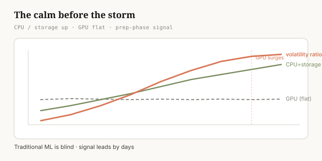
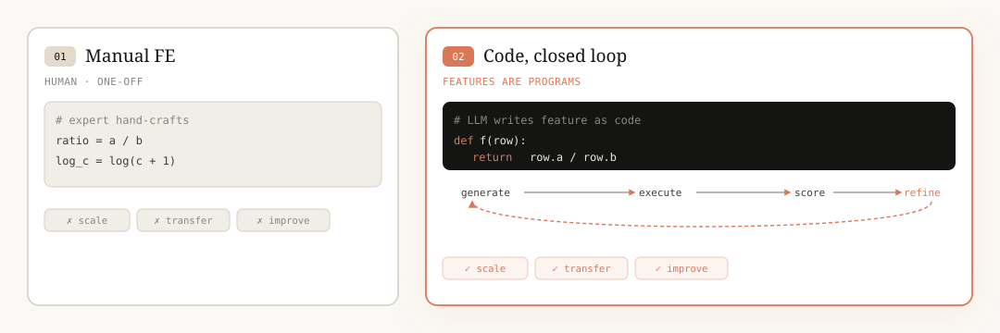
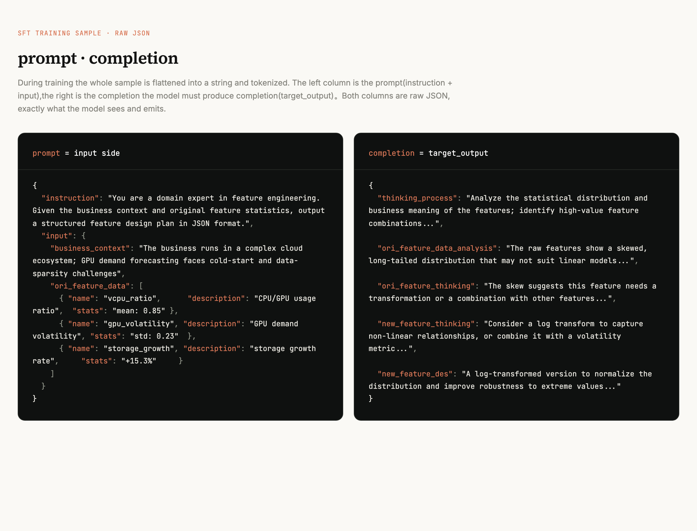
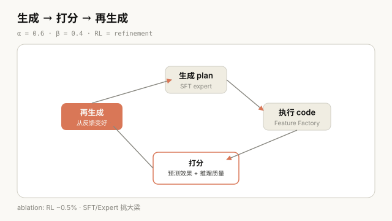
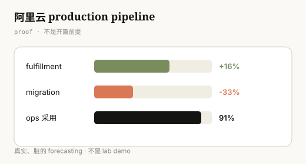
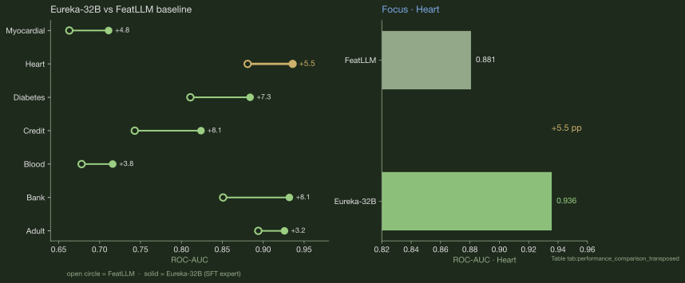

Feature engineering dies the moment you switch domains. We fix that by turning features into runnable code, then teaching a model to write them. Here's the signal that started it, and what it takes to make the approach stick.

## The Calm Before the Storm {#signal}

Frontier models change every month. Before a new model release, there's always a stretch of quiet, the calm before the storm.

Information doesn't flow freely between cloud vendors and AI labs. AI infra doesn't know exactly when a model will ship. They can only try to predict it. Before a release, an AI lab quietly stockpiles CPUs and storage next to its idle GPUs. Those resources are relatively cheap, so preparing them in advance lets the team clear preliminary work like data pipelines. GPUs are different. Even idle, they burn money. So the lab keeps the expensive GPUs switched off until the real deployment phase.

That leaves a signal during the prep phase: CPU and storage demand climb, while GPU stays flat. A traditional ML model stares at those two indicators and at best coughs up a weak correlation. It can't read the situation or tell you what to do.

<figure>
        
        <figcaption>During the prep phase, CPU and storage demand climb while GPU stays flat. A composite signal starts rising days before the real GPU surge.</figcaption>
      </figure>

**This is signal, not noise.** The fix isn't to swap in yet another bigger general model. It's to **reason out this feature**: understand what's happening during the prep phase and write it down as something verifiable.

        
Technical details

        <ul>
          <li>Two raw indicators: <code>scaled_vcpu_gpu_ratio</code> (the CPU/GPU usage ratio, elevated during prep) and <code>gpu_anomaly_acceleration_squared</code> (GPU anomaly acceleration, near zero during prep, i.e. GPU is stable).</li>
          <li>Composite indicator: <code>scaled_vcpu_gpu_volatility_ratio = scaled_vcpu_gpu_ratio / gpu_anomaly_acceleration_squared</code>. A high ratio divided by a near-zero GPU anomaly amplifies the prep phase into a strong signal.</li>
          <li>Result: it begins climbing several days before the real GPU surge, while standard indicators stay flat.</li>
        </ul>
      

The cloud we want shouldn't get caught off guard by its own customers. It should see GPU demand coming before it spikes and stage resources ahead of time. It should also predict idle periods and slumps so capacity isn't sitting around burning money. The same logic holds in healthcare, in credit, in any tabular forecasting problem. This isn't a domain-specific trick. It's a general rule.

## The Reframe: Features as Code {#reframe}

The old approaches either don't run (the LLM produces plans that go nowhere) or run without anyone understanding why (your classic AutoFE). **The problem isn't a lack of ideas. It's a lack of form.** Only when you write a feature as code can you verify, scale, transfer, and improve it all at once. Let's go back to that customer from the first section and walk through how we made it work.

<figure>
        
        <figcaption>Reframe feature engineering as code generation. The expert proposes a plan; the Feature Factory turns it into executable Python.</figcaption>
      </figure>

## Questions You Might Have {#questions}

By now you're probably thinking some version of:

- Isn't this just swapping in a bigger model?
- Why do SFT at all? Is SFT alone enough?
- If SFT alone isn't enough, why add RL?
- How much does RL actually help? Is it worth the extra step?

Let's answer them in order.

## Teaching the Model: SFT {#sft}

### Why SFT, and is SFT alone enough?

Back to the scenario: before a model release, CPU and storage quietly climb while the GPU sits still. An off-the-shelf model can't see the relationship. It doesn't know what a prep phase is. We have to post-train a model to teach it how an expert reads this signal.

After SFT, the model can reason out features like this one. But it hits a ceiling: it only imitates plans it has seen, and it can't produce combinations it hasn't. So "use a bigger model" isn't the answer on its own. You first have to teach the business.

#### Where does the SFT data come from?

We take how an expert thinks through writing a feature and turn it into training samples. This isn't moving tables around. It's teaching what makes a feature meaningful and why.

#### What does it look like, and how much is there?

<figure>
        
        <figcaption>One sample is one problem with a worked answer. Left: the scenario and the raw data on hand. Right: how the expert solves it, from "what I notice first" all the way to "so I designed this feature." The model learns the whole chain of thought, not just the final line.</figcaption>
      </figure>

The dataset is small: **no more than 2,000 samples** (the paper reports ≤ 2K Q&A pairs). You don't need hundreds of thousands. Each one is hand-written by an expert to embed domain context. Training is cheap too: 100 epochs on 4 A100s finishes in **about 6 hours**.

## Closing the Loop: RL {#rl}

### Why RL, and what happens with SFT only?

SFT only ever feeds the model high-quality expert plans, which means the model learns exactly one thing: imitation. It never learns which generation patterns are bad, so it has no judgment of its own.

Reinforcement learning fills that gap in two ways:

1.  **It teaches the model to tell good from bad.** For the same input, RL samples a batch of candidates and scores and ranks them, good and bad together. A model can only build judgment once it has seen what bad looks like.
2.  **It closes the loop between reasoning and outcome.** SFT teaches the model to reason like an expert, but it never checks whether the feature it produced actually works. RL gives that feedback back. When we generate a feature, we turn it into code and run it, then look at both the real prediction quality and whether the reasoning holds up, and adjust using a verifiable score. With right and wrong signal coming back, the model gets more accurate with every step.

## How Well Does It Work? {#results}

<figure>
        
        <figcaption>The RL loop: generate a feature, run it as code, score it on both prediction quality and reasoning quality, feed the score back.</figcaption>
      </figure>

Back to the original scenario: a cloud customer's GPU demand suddenly surges. If the vendor didn't see it coming, they get caught flat-footed. That's exactly what this framework is built to solve. **Can we predict the GPU surge in advance, and prove it's accurate on real cloud data?** We test on Alibaba Cloud's EGS dataset (real GPU usage logs). The task is simple: predict whether GPU demand will rise over the next window.

We measure accuracy with **ROC-AUC**. Think of it as a 0 to 100 score: **50 is a blind guess, 100 is perfect.** So 59 is barely better than guessing, and 70 is already pretty solid.

The table shows what happens as we add each of the three components, one at a time, starting from a baseline:

        <table>
          <thead>
            <tr><th>Step</th><th>ROC-AUC</th><th>What this step added</th></tr>
          </thead>
          <tbody>
            <tr><td>Baseline</td><td>59.26</td><td>No components added</td></tr>
            <tr><td>+ LLM Feature Factory</td><td>65.39</td><td>Turning ideas into runnable code (+6.13)</td></tr>
            <tr><td>+ Expert (SFT)</td><td>69.45</td><td>Injecting domain knowledge (+4.06)</td></tr>
            <tr><td>+ RL</td><td>69.97</td><td>Refinement from feedback (+0.52)</td></tr>
          </tbody>
        </table>
      

**The baseline is 59.26.** That's raw data with nothing added, barely better than a coin flip. Each step below stacks on top of it.

**Adding the LLM Feature Factory takes it to 65.39 (+6.13).** The Factory's job is to turn a feature idea into executable code. With it, "I want the CPU/GPU ratio" becomes an actual computable metric. This is the biggest single jump.

**Adding SFT takes it to 69.45 (+4.06).** Being able to compute isn't enough; you have to compute like you understand the domain. SFT bakes expert knowledge into the model so it recognizes things like the prep phase. The model moves from "can compute" to "computes with understanding," and the score climbs again.

**Adding RL takes it to 69.97 (+0.52).** RL is the finishing pass: the model looks at how its generated features actually performed and adjusts from the feedback. The gain is the smallest of the three, but it's real and it's upward.

That said, this 0.52 **undercounts what RL does**. The RL reward has two parts: one scores prediction accuracy, the other scores whether the reasoning is complete and sound. The ablation only measured ROC-AUC, which means it only saw the first half. The number is structurally biased low.

So it's not that RL doesn't help. It's that the ruler didn't measure the whole job. Whether RL pays off at production scale, across more scenarios, is something the paper leaves open. That's next.

        
The reward function

        
<code>R = α · R_metric + β · R_semantic</code>   (α = 0.6, β = 0.4)

        <ul>
          <li><strong>R_metric:</strong> the feature's actual prediction quality (AUC, KS, IV, correlation, importance, normalized and weighted).</li>
          <li><strong>R_semantic:</strong> a stronger LLM acts as judge, scoring whether the reasoning is complete, the causality holds, and it fits the domain logic.</li>
        </ul>
        
In plain terms: one half checks whether it works, the other checks whether it makes sense.

      

### The Feature Factory step

The Expert hands over a plan. The Feature Factory turns it into runnable Python. Three stages:

1.  **Prepare input:** metadata for the original features, historical records, statistical summaries.
2.  **Chain of thought:** the LLM generates a rationale, sets the rules, then writes the code.
3.  **Execute and evaluate:** run the code, score it, keep the features that work.

<pre><code># Expert plan -&gt; Python code
# Expert (JSON):
{
  "new_feature_thinking": "CPU/storage rising while GPU is stable means prep phase",
  "new_feature_des": "CPU/GPU ratio divided by GPU acceleration"
}

# Feature Factory (Python):
def new_feature(df):
    return df['cpu_gpu_ratio'] / df['gpu_acceleration']</code></pre>

The loop can run and score at all only because features are executable code. That's the single property that lets SFT, RL, and the Feature Factory hang off the same chain.

## In Production {#production}

<figure>
        
        <figcaption>The general idea, running on real, messy forecasting problems inside an Alibaba Cloud pipeline.</figcaption>
      </figure>

This isn't a premise from the opening. It's the proof. The approach holds up on real, dirty forecasting work inside an Alibaba Cloud production pipeline:

        

+16%

fulfillment

        

-33%

migration loss

        

91%

ops adoption

      

The middle of the argument closes here. Generalization comes next.

## Beyond One Domain {#generalize}

The same Expert ran across 7 open benchmarks spanning 3 domains. The chart below is the breadth proof: Eureka-32B (a Qwen3-32B expert after SFT) against the FeatLLM baseline on ROC-AUC. The paper's main table doesn't break out bare Qwen3-32B separately, so FeatLLM stands in as the LLM-FE comparison.

<figure>
        
        <figcaption>Eureka-32B vs FeatLLM baseline across 7 benchmarks and 3 domains.</figcaption>
      </figure>

One honest caveat: this is one expert used in many places, not a strict demonstration of cross-domain transfer. We tried it. Now it's your turn.

## Try It {#try}

If you've ever hand-built a feature that fell apart the moment you switched scenarios: try writing the plan as code, running it, and reading your own output.

If you work on AI infra forecasting: can you post-train a model to reason out a signal like the prep phase, instead of just reaching for a bigger foundation model?

Code is all you need.

