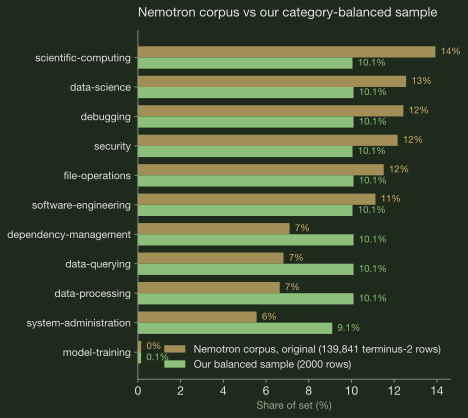

Reward design has to be grounded in the data and the failure modes. Ungrounded rewards fail quietly: you penalize failures the model does not actually have, you miss the one that kills most trials, and on a hard benchmark a bare pass/fail reward leaves GRPO groups all-zero, so nothing trains. The problems you never measured never get solved.

<figure style="margin: 2.5rem 0 3rem;">
      
      <figcaption>Figure 1: The pipeline. Classify what happened (L1), diagnose why (L2), then split by failure type: knowledge gaps go to SFT, decision failures become reward terms for GRPO.</figcaption>
    </figure>

## Benchmark selection {#benchmark}

I chose Terminal-Bench 2, as every task ships a deterministic `tests/test.sh` verifier, so the reward is a real pass/fail signal, and Harbor records full terminus-2 ATIF traces, which makes the failure taxonomy in §2 possible. Harbor gives a clean skeleton: sandboxed tasks, an agent loop, and verifiers, so I am wiring rewards onto this scaffolding instead of building the harness from scratch.

## Failure taxonomy {#taxonomy}

The baseline is `gpt-oss-20b` without any post-training, I ran a verifiable failure taxonomy on the baseline: 444 trials in Harbor, each scored by rule-based ATIF detectors. The taxonomy is inspired by [Atreja et al. \[1\]](https://dl.acm.org/doi/epdf/10.1145/3786335.3813199), who used failure detection for debugging and trace analysis; here I take it one step further and use the failure detections as reward signals.

The taxonomy has two layers: L1 classifies what happened, L2 diagnoses why. This is my own implementation based on the paper; the original Pathfinder code is not open-sourced.

<figure>
        
        <figcaption>Figure 2: The taxonomy as a system. L1 does coarse attribution (who is responsible) and quarantines what can't be attributed; L2 runs the executable detectors over every attributable trace, pass included (passes are the control group for the failure modes). Every silent trial exits the improvement queue one of two ways: A, a failure we have no detector for, so we build one and L2 grows; or B, the task or verifier itself is broken, so we add a quarantine rule and L1 grows.</figcaption>
      </figure>

The taxonomy runs once per policy, not once per project. This post shows the first run, on the base model. The plan is to run it again on the SFT model before designing the RL reward: each training stage changes how the model fails, so each stage's reward consumes a fresh measurement.

### L1 classification {#taxonomy-layers}

We categorize each agent trial into four categories (`pass` 21 · `verifier_fail` 372 · `agent_timeout` 46 · infra 5, of 444 trials), so that we don't count infra crashes as agent behavior, and we can bypass the tasks the agent already passed (a baseline shortcut; in the next iteration passes also run through L2, as the control group for the failure modes).

        <figure>
          
          <figcaption>Figure 3: Harbor L1 classifications. Mostly <code>verifier_fail</code> (~84%), not timeout. The learning problem is how the agent fails the verifier.</figcaption>
        </figure>
        <figure>
          
          <figcaption>Figure 4: Analysis funnel. 38 silent trials: verifier failed but no ATIF signal for a mode penalty. Design rule: only penalize computed trace evidence.</figcaption>
        </figure>
      

L1 is a rule-based function over two fields of Harbor's `result.json`, deterministic. We don't use an LLM judge here.

Show the L1 pseudocode

      <pre><code># one Harbor trial = one result.json + one ATIF trace
for result_json in jobs/&lt;shard&gt;/*/result.json:
    row = normalize(result_json)      # flatten to: task, trial_name, reward
                                      # (= verifier_result.rewards.reward),
                                      # exception_type, exception_message
    row.l1 = classify_l1(row)         # L1 is a rule-based function, no LLM
    #   reward &gt;= 1.0                  -&gt; pass
    #   AgentTimeoutError              -&gt; agent_timeout
    #   vLLM / API / image-build error -&gt; infra_*
    #   else (tests ran and failed)    -&gt; verifier_fail
    upsert(supabase.tb2_trials, row)  # one row per trial, keyed by trial_name</code></pre>
      

### L2 diagnosis {#taxonomy-modes}

For only the verifier-fail trials, we run executable detectors over the agent trace to diagnose how the agent failed.

- This bucket has 84% of the L1 classifications, with complete traces and clean failure semantics, which makes it the highest-ROI bucket to tackle first. 334 of the 372 get a trace-visible diagnosis; the other 38 are silent (the verifier failed but no detector fired), so these are skipped.
- Timeouts are deprioritized at the baseline because there is only a very small amount of it (10% of trials, vs 84% verifier_fail). But this routing choice should follow the failure distribution: you will have to re-derive it after each training stage, because the failure taxonomy can change given the model weight change.

After excluding the 38 silent trials, we have 334 trials with trace evidence. Figures 5 and 6 are computed over these.

        <figure>
          
          <figcaption>Figure 5: Executable failure modes. Primary chart for reward design. Headline: the missing-reflection family (<code>premature_complete</code> + <code>error_unaddressed</code>) fires 434+ times across multi-label trials.</figcaption>
        </figure>
        <figure>
          
          <figcaption>Figure 6: Failure step distribution. First failures cluster at steps 2–3, not the turn cap. Bottleneck is wasted actions early, not horizon length.</figcaption>
        </figure>
      

        
Table 1: Executable failure modes and their computed signals

        <table>
          <thead><tr><th>Failure mode</th><th>Detector</th><th>Computed signal</th></tr></thead>
          <tbody>
            <tr><td>Misreflection</td><td><code>error_unaddressed</code></td><td>Prior step had errors; next step did not address them</td></tr>
            <tr><td>Early submit</td><td><code>premature_complete</code></td><td><code>mark_task_complete</code> while errors still present</td></tr>
            <tr><td>Infinite loop</td><td><code>repeat_command_loop</code></td><td>Same bash keystrokes repeated ≥3×</td></tr>
            <tr><td>Non-converging</td><td><code>high_wasted_commands</code></td><td>≥50% agent steps carry error observations</td></tr>
            <tr><td>Environment dependency</td><td><code>missing_env</code></td><td>command not found / ModuleNotFoundError</td></tr>
            <tr><td>Context pressure</td><td><code>context_pressure</code></td><td><code>prompt_tokens</code> ≥ 25K/step or total ≥100K</td></tr>
            <tr><td>Malformed JSON</td><td><code>json_parse_warning</code></td><td>JSON parse errors in observation or message</td></tr>
          </tbody>
        </table>
      

Each L2 detector is a rule-based function too, deterministic (regex, counters, thresholds over the trace). We don't use an LLM judge here.

Show the L2 pseudocode

      <pre><code># L2: verifier_fail rows only
# (routing chosen from the baseline distribution; re-derive per stage)
for row in supabase.tb2_trials where l1 == "verifier_fail":
    hit = first_hit(ordered_detectors, atif_trace(row))
    #   each detector = regex/counter rules over the trace, no LLM
    #   error_unaddressed, premature_complete, repeat_command_loop, ...
    update row set l2_failure_class = hit.code,   # null -&gt; silent
                   evidence_step    = hit.step</code></pre>
      

### Findings {#taxonomy-findings}

Two findings drive the reward design. The agent mostly fails by submitting too early: the missing-reflection family (premature complete plus unaddressed errors) dominates Figure 5. And those failures land at steps 2–3, not at the turn cap (Figure 6), so the bottleneck is wasted early actions, not horizon length.

The failure modes also decide what goes to SFT and what goes to RL:

        
Table 2: Failure type → training stage

        <table>
          <thead><tr><th>Failure type</th><th>Modes</th><th>Fix</th></tr></thead>
          <tbody>
            <tr><td>Doesn't know the move</td><td><code>missing_env</code> · <code>json_parse</code></td><td>SFT cold start (§4.3)</td></tr>
            <tr><td>Knows the move, decides badly</td><td><code>premature_complete</code> · <code>error_unaddressed</code> · loops</td><td>Reward penalties (§3.3)</td></tr>
          </tbody>
        </table>
      

The logic: demonstrations teach moves, rewards teach decisions. You can imitate how to install a dependency; you can't imitate when to stop. §3.3 gives every detector its disposition.

### Data lens: preparing the SFT and RL data {#data-lens}

§2.3 decided which failure modes go to SFT and which go to RL. The data lens is the other half of that decision: what data actually teaches them. Every TB2 task ships `category` and `difficulty` in `task.toml`: 89 tasks across 16 categories, dominated by software-engineering (26 tasks), with difficulty medium 55 · hard 30 · easy 4. That distribution is something we need to be aware of.

My chosen SFT data is NVIDIA's [Nemotron-Terminal-Corpus](https://huggingface.co/datasets/nvidia/Nemotron-Terminal-Corpus): terminus-2 trajectories subsampled from a ~140k-row pool. Balanced data selection is made against TB2: same agent format, explicit category balance, and a turn/token budget aligned with `MAX_TURNS` so imitation does not teach verbosity.

The corpus's own mix is fairly even: an equal share of every category. 2,000 rows, 11 categories, about 200 each. Rows come out in category round-robin order, so any prefix of the file is balanced too; the first 500 are the cold-start set.

        <figure style="margin: 0;">
          
          <figcaption>Figure 7: Source corpus vs the first-round sample: each of the 11 categories gets an equal share.</figcaption>
        </figure>
        <figure style="margin: 0;">
          
          <figcaption>Figure 8: The same sample vs the eval anchor. Six eval categories do not exist in the corpus at all; model-training survives the quality gates with only 3 rows.</figcaption>
        </figure>
      

Why equal shares instead of copying the eval mix? At n=89 the anchor's percentages are noise: 29% software-engineering is 26 tasks. And SFT cold start teaches format and terminal habits, which transfer across categories; what it needs is coverage and variety, not ratio matching. We can adjust the data sampling based on the first iteration of the eval result.

Both datasets are browsable row by row, with provenance on every row, in the [data viewer](data-viewer.html).

## Environment creation {#environment}

An RL environment is three design decisions: what the agent sees (observation), what it can do (actions), and what it gets rewarded for. For Terminal-Bench 2, the first two mostly follow Harbor's terminus-2 setup; the real design work is in the reward, and that is where the failure taxonomy from §2 comes in.

Mechanically, with TRL + Harbor each task episode runs in a sandbox and ends with a verifier reward. During training GRPO samples G rollouts per task and normalizes advantages within the group, so the reward only has to be right in a relative sense across rollouts of the same task, not calibrated on an absolute scale.

### State / observation space {#observation}

One Terminal-Bench 2 task = one multi-turn episode in a persistent Harbor sandbox. The policy uses the terminus-2 format to interact with the sandbox.

Episode: 1 task = 1 persistent sandbox. At step *t*, the policy sees the chat transcript's token sequence.

<pre><code>[ system prompt | instruction.md | (assistant_turn, env_feedback)_1 … (assistant_turn, env_feedback)_{t-1} ]</code></pre>

          
Table 3: Observation space

          <table>
            <thead><tr><th>Component</th><th>Content</th></tr></thead>
            <tbody>
              <tr><td>System prompt</td><td>Terminal coding agent; acts only via <code>bash</code></td></tr>
              <tr><td>Task instruction</td><td>TB2 <code>instruction.md</code></td></tr>
              <tr><td>History</td><td>Per-step bash stdout/stderr/exit code</td></tr>
              <tr><td>Encoding</td><td>Model chat template; <code>loss_mask</code> trains agent tokens only</td></tr>
              <tr><td>Bounds</td><td><code>max_seq_len</code> (e.g. 8K train / 32K eval)</td></tr>
            </tbody>
          </table>
        

Observation is partial and stateful: same instruction, different history across steps. Harbor rollouts convert to prompt/completion pairs with a `loss_mask` for TRL `GRPOTrainer`.

### Action space {#action}

At each step, the policy emits one terminus-2 message. The meaningful action is what happens in the sandbox.

          
Table 4: Action space

          <table>
            <thead><tr><th>Dimension</th><th>Definition</th></tr></thead>
            <tbody>
              <tr><td>Action</td><td>One generation → one terminus-2 message</td></tr>
              <tr><td>Semantic action</td><td>One <code>bash</code> tool call or <code>mark_task_complete</code></td></tr>
              <tr><td>Effect</td><td>Command runs in sandbox; state persists across steps</td></tr>
              <tr><td>Horizon cap</td><td><code>MAX_TURNS</code> (≈6 train / 20 eval)</td></tr>
            </tbody>
          </table>
        

Horizon is capped at 6 in training since first failures cluster at steps 2–3 (Figure 6); eval keeps 20 for long-horizon recovery, a deliberate train/eval gap.

### Reward functions {#rewards}

§2 tells me *what fails*; this is *what I optimize*. P0 is the core set; P1 are refinements I add if there is bandwidth.

The mapping is deliberately boring, and that is the point: every reward term traces back to a row in the taxonomy, and anything the taxonomy did not show me, I do not reward. The dominant failure, most trials miss the verifier, calls for dense partial credit so the GRPO groups are not all zeros. The early-submit and loop failures get explicit penalties, but only on top of partial credit, not in place of it. The 38 silent trials get nothing extra, because I cannot see why they failed and I will not penalize what I cannot measure.

          
Table 5: Failure → reward mapping

          <table>
            <thead><tr><th>Failure</th><th>Reward</th><th>Priority</th></tr></thead>
            <tbody>
              <tr><td>Most trials fail verifier (~84%)</td><td><code>R_outcome</code>: partial credit from CTRF</td><td>P0</td></tr>
              <tr><td>Early submit, tests partly pass</td><td>Same <code>R_outcome</code></td><td>P0</td></tr>
              <tr><td>Mark done while tests fail</td><td>Penalty <code>−lam_pc · 1[premature_complete]</code></td><td>P1</td></tr>
              <tr><td>Repeat loops / wasted bash</td><td><code>R_agency</code> tiebreaker among successes</td><td>P1</td></tr>
              <tr><td>Failures at steps 2–3, not turn cap</td><td>No horizon bonus or per-step shaping</td><td>P0</td></tr>
              <tr><td>Silent trials (38)</td><td><code>R_outcome</code> only</td><td>P0</td></tr>
              <tr><td><code>error_unaddressed</code></td><td>No separate term; same family as premature complete, penalized at the submit step</td><td>P1</td></tr>
              <tr><td><code>missing_env</code> / <code>json_parse</code></td><td>No reward term; targeted by the SFT cold start (§4.3)</td><td>P2</td></tr>
              <tr><td><code>context_pressure</code></td><td>No reward term; handled by env design, <code>MAX_TURNS</code> + truncated observations (§3.1)</td><td>P2</td></tr>
            </tbody>
          </table>
        

With these rows, all 7 detectors have an explicit disposition: imitation (SFT), reward pressure (RL), environment design, or deliberately nothing. This is the proposed plan; the P1/P2 terms are implemented but not all ablated yet.

`R_outcome`: `passed_tests / total_tests ∈ [0, 1]`. No LLM rubric.

`R_agency`: Among rollouts with `R_outcome = 1.0`, rank by `turns` + `wasted_commands`; bonus ∈ \[0, λ\]. It is only a tiebreaker, and it needs at least two successes in a group to fire at all. Early in training, when ~84% of trials fail, it almost never triggers. That is on purpose: efficiency only becomes worth rewarding once the model passes often enough to choose between a clean solution and a messy one.

`R_integrity`: Void trajectory on test/verifier tampering, hardcoded answers, or exfiltration (`total ≤ 0`).

<pre><code>total_i = R_outcome_i + λ · agency_bonus_i − integrity_penalty_i − lam_pc · 1[premature_complete]</code></pre>

P0: outcome + integrity (`λ = 0`, `lam_pc = 0`). P1: agency and premature-complete penalty.

          
Table 6: Implemented in code (42 tests)

          <table>
            <thead><tr><th>Term</th><th>What it does</th><th>Module</th><th>Default mode</th></tr></thead>
            <tbody>
              <tr><td>R_outcome</td><td><code>passed_tests / total_tests</code> from the CTRF report; dense partial credit so GRPO groups don't go all-zero when most rollouts fail</td><td><code>r_outcome</code></td><td>P0 on</td></tr>
              <tr><td>R_integrity</td><td>Voids the trajectory (total ≤ 0) on test tampering, hardcoded answers, or exfiltration; the anti-reward-hacking fuse</td><td><code>r_integrity</code></td><td>P0 on</td></tr>
              <tr><td>R_agency</td><td>Efficiency tiebreaker among rollouts that fully pass, ranked by turns + wasted commands; needs ≥2 successes in a group to fire</td><td><code>r_agency</code> + group tiebreak</td><td>P1 (<code>lam=0.1</code>)</td></tr>
              <tr><td>premature_complete</td><td>Penalty for <code>mark_task_complete</code> while errors are still visible in the trace; the taxonomy's top failure</td><td><code>r_premature_complete</code></td><td>P1 (<code>lam_pc=0.1</code>)</td></tr>
              <tr><td>Other Figure 5 detectors</td><td>Routed to SFT (§4.3) or env design (§3.1), not to reward</td><td>-</td><td>Not rewarded (design only)</td></tr>
            </tbody>
          </table>
        

## Model selection and training plan {#training}

With the environment fixed, the training plan is mostly downstream of it. Two choices still carry weight: which model I start from, and how I stop GRPO from burning rollouts on tasks it cannot learn from. The rest of this section is those two decisions and the knobs around them.

### Base model {#base-model}

Decision: `openai/gpt-oss-20b`

Aligns with the Terminal-Bench 2 blog stack: Harbor + terminus-2 + gpt-oss-20b + verifiable rewards + GRPO. The baseline is verifier-dominated (~84% `verifier_fail`), not timeout-limited; dense partial credit produces non-degenerate GRPO groups instead of all-zero advantages.

`gpt-oss-120b` is the natural teacher for a later on-policy distillation (OPD) stretch: dense per-token signal when rollouts end at zero verifier reward or truncate early (Figure 4 silent bucket, Figure 6 early-step cluster).

### RL algorithm {#grpo}

Decision: GRPO via TRL `GRPOTrainer` on Harbor rollouts.

For each task prompt, sample G independent terminus-2 rollouts, score with §3.3 rewards, normalize advantages within the group:

<pre><code>Â_i = (R_i − mean(R_{1..G})) / (std(R_{1..G}) + ε)</code></pre>

          
Table 7: Why GRPO fits this environment

          <table>
            <thead><tr><th>Property</th><th>Fit</th></tr></thead>
            <tbody>
              <tr><td>Verifiable scalar reward</td><td><code>R_outcome</code> from <code>tests/test.sh</code>; no learned RM</td></tr>
              <tr><td>High variance across rollouts</td><td>Same task, different bash traces → spread in partial credit</td></tr>
              <tr><td>No critic network</td><td>Simpler than PPO on long multi-turn trajectories</td></tr>
              <tr><td>Reference recipe</td><td>GRPO [4] · AfterQuery blog + Eureka SFT→GRPO [3]</td></tr>
            </tbody>
          </table>
        

          
Table 8: Training stack

          <table>
            <thead><tr><th>Stage</th><th>Role</th><th>Planned</th></tr></thead>
            <tbody>
              <tr><td>SFT</td><td>Cold-start terminus-2 + occasional verifier passes</td><td>Yes</td></tr>
              <tr><td>OPD (optional)</td><td>gpt-oss-120b teacher, reverse-KL on student trajectories</td><td>Stretch</td></tr>
              <tr><td>GRPO</td><td>On-policy improvement with composed rewards</td><td>Yes</td></tr>
            </tbody>
          </table>
        

### Data splits and curriculum {#data}

          
Table 9: Data splits

          <table>
            <thead><tr><th>Split</th><th>Source</th><th>Size</th><th>Use</th></tr></thead>
            <tbody>
              <tr><td>SFT gold</td><td><code>nvidia/Nemotron-Terminal-Corpus</code></td><td>500 trajectories</td><td>SFT cold-start</td></tr>
              <tr><td>GRPO pool</td><td><code>nvidia/Nemotron-Terminal-Synthetic-Tasks</code></td><td>5,984 tasks; ~10–50 in band/run</td><td>Rollout + update</td></tr>
              <tr><td>Probe band (discovery sweep)</td><td>Subset of synthetic pool</td><td>10–80% pass@k</td><td>Curriculum gate</td></tr>
              <tr><td>Eval (held-out)</td><td>Official Terminal-Bench 2</td><td>89 × k=5</td><td><code>pass@1_macro</code></td></tr>
              <tr><td>Eval (fast)</td><td>10-task slice</td><td>10 × k=5</td><td>Iteration gate</td></tr>
            </tbody>
          </table>
        

<blockquote>
          The probe band (10–80%) is a wide discovery sweep to find learnable tasks; GRPO then trains on the
          20–60% sub-band, where group advantage is richest. Tasks at 0% or 100% contribute little or no group advantage.
        </blockquote>

### Hyperparameters {#hyperparams}

Single-node LoRA on gpt-oss-20b (16GB-class MoE with mxfp4). Anchored to the AfterQuery blog band.

          
Table 10: LoRA SFT + GRPO configuration

          <table>
            <thead><tr><th>Parameter</th><th>SFT</th><th>GRPO rollouts</th><th>GRPO update</th></tr></thead>
            <tbody>
              <tr><td>Base weights</td><td><code>openai/gpt-oss-20b</code></td><td>SFT checkpoint</td><td>Same</td></tr>
              <tr><td>Adapter</td><td>LoRA r=32, α=64</td><td>-</td><td>Trainable</td></tr>
              <tr><td>Learning rate</td><td>2e-5</td><td>-</td><td>1e-6</td></tr>
              <tr><td>Optimizer</td><td>AdamW β=(0.9, 0.95)</td><td>-</td><td>AdamW</td></tr>
              <tr><td>Steps</td><td>250 (500 demos)</td><td>15 rounds</td><td>13–15</td></tr>
              <tr><td>Group size G</td><td>-</td><td>8</td><td>8</td></tr>
              <tr><td>Max turns (train / eval)</td><td>-</td><td>6</td><td>20 eval</td></tr>
              <tr><td>Max seq len</td><td>8K</td><td>8K</td><td>8K train; 32K eval</td></tr>
              <tr><td>Temperature</td><td>-</td><td>0.7</td><td>-</td></tr>
              <tr><td>Eval temperature</td><td>-</td><td>-</td><td>1.0</td></tr>
            </tbody>
          </table>
        

Eval samples k=5 per task at temperature 1.0; `pass@1_macro` is the per-task pass rate averaged over those 5 samples, so a non-zero eval temperature is intentional sampling for the macro estimate rather than a single greedy decode.

LoRA on the mxfp4 MoE base: adapters sit on the mxfp4 MoE weights, target the attention and router projections, stay in bf16, and are validated for numerical stability on a 1-step smoke run before the full job.

Rollout gate

<pre><code># Only commit a GRPO update when reward variance exists within a batch
std(R_{1..G}) &gt; 0  for at least one task group</code></pre>

### Metrics {#metrics}

          
Table 11: Metrics

          <table>
            <thead><tr><th>Phase</th><th>Metric</th><th>Purpose</th></tr></thead>
            <tbody>
              <tr><td>Eval</td><td><code>pass@1_macro</code> on held-out 89</td><td>Headline benchmark lift</td></tr>
              <tr><td>Eval</td><td>Per-task pass rate, L1 outcome mix</td><td>Tie back to taxonomy</td></tr>
              <tr><td>SFT</td><td>Train loss, eval pass@1 vs base</td><td>Cold-start signal</td></tr>
              <tr><td>GRPO rollouts</td><td>Mean/std of <code>R_outcome</code>; fraction with <code>reward_std &gt; 0</code></td><td>Gate policy updates</td></tr>
              <tr><td>GRPO update</td><td><code>grad_norm</code>, clipped fraction, KL</td><td>Stability</td></tr>
              <tr><td>GRPO update</td><td><code>premature_complete</code>, <code>repeat_command_loop</code> rates</td><td>Ablation vs taxonomy</td></tr>
              <tr><td>Integrity</td><td>Voided trajectories (<code>R_integrity</code>)</td><td>Reward hacking guard</td></tr>
            </tbody>
          </table>
        

End-to-end validation would run Harbor trajectories with CTRF rewards on Nemotron tasks, confirm ≥1 GRPO step with `reward_std > 0`, and check that a rep-10 eval shows monotonic base → SFT → GRPO lift. The sections above are the design; full training runs are future work.

Primary ablation: P0 (`R_outcome` + `R_integrity`) vs P1 (+ `R_agency` + `premature_complete`).

## Closing & future steps {#limitations}

The bet at the top of this post was: the problems you never measured never get solved. This design is that bet applied end to end. Nothing gets penalized, trained on, or capped without a verifiable measurement behind it, and the measurement itself reruns on the SFT model before the RL reward is locked.

What I would fix next:

1.  **Reward hacking.** The taxonomy itself is an analysis tool: I decide how the reward gets shaped, so the environment guides the agent to learn properly. But once a rule is part of the reward, it runs automatically on every rollout, and rollouts that happen to dodge its text pattern (clear the error text before submitting, say "let me fix this" and do nothing) score higher and get reinforced. That is why the outcome reward dominates and the penalties stay small: hacking a rule never moves the test score.
2.  **No human verification yet.** No human labels, so I am not sure how often each detector fires wrongly, and a bad detector brings noise into the reward. Two things to do: hand-label some data, and build a validation approach that can check a detector's results quickly. Where possible, a detector should rerun the failing test instead of matching error text: execution is harder to fool.
3.  **Generalization.** The detectors are TB2-specific; the method is not. It needs a deterministic verifier and full traces, nothing else, and the same two-layer taxonomy can run on τ²-bench retail with a different detector pack.

## References {#references}

1.  Dhruv Atreja. 2026. Pathfinder: Self-Improving Agent Trace Analysis via Adversarial Self-Play and Code Execution. *ACM Conference on AI and Agentic Systems*, 1336–1339. [doi:10.1145/3786335.3813199](https://doi.org/10.1145/3786335.3813199)
2.  Jacob Helwig. 2026. On-Policy Distillation (OPD). verl documentation. [verl.readthedocs.io](https://verl.readthedocs.io/en/latest/algo/opd.html)
3.  Li, Hangxuan, et al. 2026. Eureka: Intelligent Feature Engineering for Enterprise AI Cloud Resource Demand Prediction. *DASFAA 2026*.
4.  Shao, Zhihong, et al. 2024. DeepSeekMath: Pushing the Limits of Mathematical Reasoning in Open Language Models. *arXiv preprint* arXiv:2402.03300. [arxiv.org/abs/2402.03300](https://arxiv.org/abs/2402.03300)

## Appendix {#appendix}

### A. Failure taxonomy × TB2 detectability {#appendix-a}

**L1: Classification.** L1 answers "what happened to this trial": the tests passed, the tests ran and failed, the agent ran out of time, or the infra broke before the agent got a fair shot. It is a pure if/else over two fields of Harbor's `result.json` (verifier reward + exception type), no LLM.

**L2: Diagnose.** L2 answers "why did the agent fail the tests": for each verifier-fail trial, a set of small rules (regex, counters, thresholds) scan the trace and name the failure mode, each hit pinned to a specific step with the evidence attached.

Optional mapping from Atreja et al. \[1\] to terminus-2 + Harbor ATIF.

          
Table A1: Paper taxonomy × TB2 detectability

          <table>
            <thead><tr><th>Paper family</th><th>Subtype</th><th>TB2</th><th>How / count</th></tr></thead>
            <tbody>
              <tr><td>Architecture</td><td>Missing reflection</td><td>yes</td><td><code>premature_complete</code>, <code>error_unaddressed</code> · 434+</td></tr>
              <tr><td>Architecture</td><td>Infinite loop</td><td>yes</td><td><code>repeat_command_loop</code> · 73</td></tr>
              <tr><td>Architecture</td><td>Non-converging planner</td><td>yes</td><td><code>high_wasted_commands</code> · 123</td></tr>
              <tr><td>Context</td><td>Window overflow</td><td>yes</td><td><code>context_pressure</code> · 51</td></tr>
              <tr><td>Parsing/config</td><td>Malformed JSON</td><td>yes</td><td><code>json_parse_warning</code> · 25</td></tr>
              <tr><td>Parsing/config</td><td>Missing env</td><td>yes</td><td><code>missing_env</code> · 131</td></tr>
              <tr><td>Prompt</td><td>Contradictory instructions</td><td>no</td><td>Prompt not in ATIF spans</td></tr>
              <tr><td>Tool misuse</td><td>Malformed tool schema</td><td>no</td><td>Only bash + mark_task_complete</td></tr>
              <tr><td>Streaming/API</td><td>Tool-call breaks</td><td>no</td><td>No streaming spans</td></tr>
            </tbody>
          </table>
        

### B. Framework & stack {#appendix-b}

The design above does not lean much on which trainer I use; this section is the reproducibility detail. I run GRPO \[4\] (group-relative advantages on verifiable rewards) in TRL, with Harbor as the environment layer.

Why GRPO. This is the same post-training recipe I have already shipped in production. In Eureka \[3\], we frame enterprise feature engineering as *agentic code generation*: SFT cold-start on domain plans, then GRPO on a composed reward. Terminal-Bench 2 is the same shape at a different domain, but the loop is identical: sample rollouts, score with verifiers, normalize advantages within a group, update the policy.

#### Considerations

        <strong>SkyRL</strong>
        Strong agentic coding integration; I would use it for production post-training on coding
        agents. When building Sofa Genius (sofagenius.ai), SkyRL train was powerful but operationally heavy with long
        debugging loops. When the focus is environment and reward design, I want to mitigate infra risk.
      

        <strong>veRL</strong>
        Great for large-scale multi-node training and first-class on-policy distillation (OPD) [2]:
        the student samples rollouts from its own policy, and the teacher provides next-token log-probabilities on
        those student-visited states. Compared with RLVR, OPD provides dense, token-level supervision. For a single-node setup I doubt we need multi-node training, so veRL's setup cost isn't worth it.
      

        <strong>SLIME</strong>
        Relatively new, backed by Z.AI and the GLM family, hackable for custom pipelines. Environment glue is not
        first-class.
      

        <strong>TRL (chosen)</strong>
        Hugging Face ecosystem; mature SFT + GRPO; decouples cleanly from Harbor as the environment layer. Keeps the
        design (observation, action, reward, and training plan) legible and reproducible. I chose Terminal-Bench 2 with Harbor using TRL.
      

        
Table A2: Stack

        <table>
          <thead><tr><th>Layer</th><th>Choice</th></tr></thead>
          <tbody>
            <tr><td>Environment</td><td>Harbor (Modal/Docker sandboxes, terminus-2 agent, test.sh verifiers)</td></tr>
            <tr><td>SFT</td><td>TRL <code>SFTTrainer</code></td></tr>
            <tr><td>RL</td><td>TRL <code>GRPOTrainer</code></td></tr>
            <tr><td>Reward</td><td>Custom module on verifier output (composed shaping terms)</td></tr>
          </tbody>
        </table>
      

