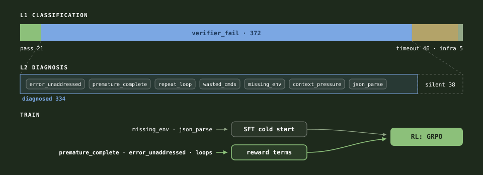
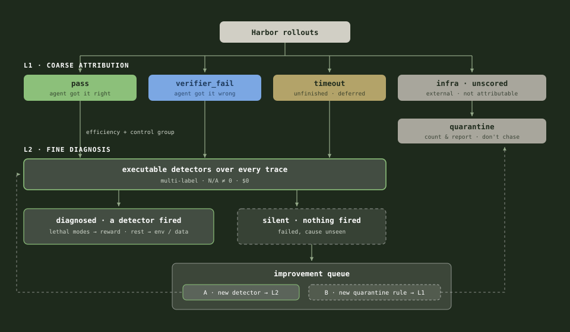
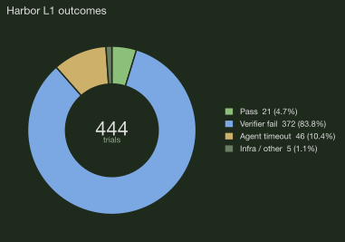
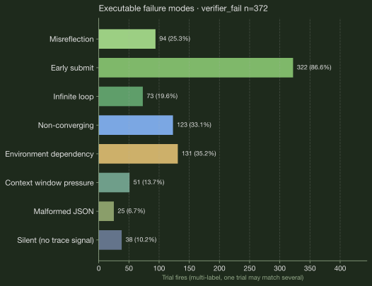

# Reward Shaping via Failure Taxonomy

Designing an RLVR Environment from a Failure Taxonomy (Terminal-Bench 2)

**Lily Zhang** · Jun 10, 2026

> Source: live HTML at `index.html` (sibling file). Figures live in `figures/`. Edit this `.md` directly; the HTML is the published artifact.

---

Without looking at the data and the failure modes, the reward designs are not well grounded. I ran a verifiable failure taxonomy on `gpt-oss-20b` before writing reward terms, then designed the RLVR environment.



*Figure 1: The pipeline. Classify what happened (L1), diagnose why (L2), then split by failure type: knowledge gaps go to SFT, decision failures become reward terms for GRPO.*

/TODO: add data distribution analysis, 2 lens: one len from data, one len from model

/TODO: set up a trace viewer

**Pre-Friday run fixes (ranked by impact):**

> /TODO 1 (high): **Fix data filter — binary pass_rate → CTRF variance.** The probe script (`scripts/probe_nemotron_band.py`) still uses `BAND_LO < pass_rate < BAND_HI`. Change to `reward_std > 0 AND mean_reward >= 0.1`. Re-probe wave 1 + wave 2 (200 tasks). Expected yield: ~130 in band vs. current 9. See §4.3 for rationale.
>
> /TODO 2 (high): **Expand training task pool to 50–80.** Depends on TODO 1. After re-probe with CTRF variance filter, subsample 50–80 from ~130 in-band. Current run used only 10.
>
> /TODO 3 (medium): **Analyze success-trajectory turn distribution before locking MAX_TURNS.** Current cap of 6 is justified by failure distribution only (first failures at steps 2–3). Pull successful trajectories from 444-trial baseline + probe rollouts, plot turn count for successes vs. failures, set MAX_TURNS to 90th percentile of successes. If > 6, raise cap. See §3.2.
>
> /TODO 4 (medium): **Run R1 ablation (composed_default reward).** R_agency + premature_complete penalty are implemented and tested but never run (T33B used `ctrf_only`, lam=0.0). R1 reuses existing T33 rollouts — one command, no new Harbor compute: `REWARD_MODE=composed_default ./scripts/run_grpo_t33b.sh train`. Gives P0 vs P1 ablation. See §3.3.
>
> /TODO 5 (low): **Verify v2 checkpoint is the presented model.** T33B v1 had a broken LoRA load (only attention tensors, MoE missing). v2 fixed by training on SFT merged weights. Confirm `reports/grpo_merged_pinned.txt` → `lilyzhng/gpt-oss-20b-tb2-grpo@665ec8d` is v2, not v1. See T33B artifact.
>
> /TODO 6 (high): **Run full 89-task eval on GRPO checkpoint.** Baseline (4.77%) and SFT (10.79%) were evaluated on the full 89-task set (445 trials), but GRPO was only evaluated on the 10-task rep-10 proxy (16.0%). For Friday, run the full 89 on the GRPO merged checkpoint using the existing T20 sharded eval pipeline (`run_sft_eval.sh full`, 5 shards, prewarmed Docker images). This gives a real head-to-head: 4.77% → 10.79% → ?% on full 89, directly comparable to the blog's 3.1% → 13.5% → 17.0%. ~2-3 hours compute. Until this runs, present rep-10 numbers with explicit "10-task pinned subset" qualification.
>
> /TODO 7 (low): **Build a trace viewer for the 38 silent trials.** 38 trials failed the verifier but triggered no ATIF detector — no visible failure mode. Current design rule: only penalize computed trace evidence, so these get R_outcome only. Without a trace viewer, cannot determine whether these are data quality issues (broken tasks/verifiers) or taxonomy gaps (uncovered model behaviors). Candidate tool: Raindrop MCP to ingest Harbor ATIF traces and surface patterns in the silent bucket. For Friday, current framing is defensible: "38 trials had no detectable failure mode; I chose not to penalize what I cannot measure."

The method carries to any RL environment: decompose it, measure how it actually fails, reward against that.

## 1. Benchmark selection

I chose Terminal-Bench 2. Every task ships a deterministic `tests/test.sh` verifier, so the reward is a real pass/fail signal with no learned judge, and Harbor records full terminus-2 ATIF traces, which is what makes the failure taxonomy in §2 possible. Harbor also gives a clean skeleton for an RL environment, sandboxed tasks, an agent loop, and verifiers, so I am wiring rewards onto solid scaffolding instead of building the harness from scratch.

## 2. Failure taxonomy

This is the part that grounds everything downstream, so it comes first. I ran a verifiable failure taxonomy on a Terminal-Bench 2 baseline: 444 trials in Harbor (the sandboxed TB2 runner, driving a terminus-2 agent loop), each scored by rule-based ATIF detectors rather than an LLM judge. The taxonomy is inspired by [Atreja et al. [1]](https://dl.acm.org/doi/epdf/10.1145/3786335.3813199), who used failure detection for debugging and trace analysis; here I take it one step further and use the failure detections as reward signals.

The taxonomy has two layers: L1 classifies what happened, L2 diagnoses why. This is my own implementation based on the paper; the original Pathfinder code is not open-sourced.



*Figure 2: The taxonomy as a system. L1 does coarse attribution (who is responsible) and quarantines what can't be attributed; L2 runs the executable detectors over every attributable trace, pass included (passes are the control group for the failure modes). Every silent trial exits the improvement queue one of two ways: A, a failure we have no detector for, so we build one and L2 grows; or B, the task or verifier itself is broken, so we add a quarantine rule and L1 grows.*

### 2.1 L1 classification

We categorize each agent trial into four categories (`pass` 21 · `verifier_fail` 372 · `agent_timeout` 46 · infra 5, of 444 trials), so that we don't count infra crashes as agent behavior, and we can bypass the tasks the agent already passed (a baseline shortcut; in the next iteration passes also run through L2, as the control group for the failure modes).



*Figure 3: Harbor L1 outcomes. Mostly `verifier_fail` (~84%), not timeout. The learning problem is **how** the agent fails the verifier.*


*Figure 4: Analysis funnel. 38 silent trials: verifier failed but no ATIF signal for a mode penalty. Design rule: only penalize computed trace evidence.*

L1 is a rule-based function over two fields of Harbor's `result.json`, deterministic. We don't use an LLM judge here.

<details><summary>Show the L1 pseudocode</summary>

```
# one Harbor trial = one result.json + one ATIF trace
for result_json in jobs/<shard>/*/result.json:
    row = normalize(result_json)      # flatten to: task, trial_name, reward
                                      # (= verifier_result.rewards.reward),
                                      # exception_type, exception_message
    row.l1 = classify_l1(row)         # L1 is a rule-based function, no LLM
    #   reward >= 1.0                  -> pass
    #   AgentTimeoutError              -> agent_timeout
    #   vLLM / API / image-build error -> infra_*
    #   else (tests ran and failed)    -> verifier_fail
    upsert(supabase.tb2_trials, row)  # one row per trial, keyed by trial_name
```

</details>

### 2.2 L2 diagnosis

For only the verifier-fail trials, we run executable detectors over the agent trace to diagnose how the agent failed.

- This bucket has 84% of the L1 outcomes, with complete traces and clean failure semantics, which makes it the highest-ROI bucket to tackle first.
- 334 of the 372 get a trace-visible diagnosis; the other 38 are silent (the verifier failed but no detector fired), so these are skipped.
- Timeouts are deprioritized at the baseline because there is only a very small amount of it (10% of trials, vs 84% verifier_fail). But this routing choice should follow the failure distribution: you will have to re-derive it after each training stage, because the failure taxonomy can change given the model weight change.

After excluding the 38 silent trials, we have 334 trials with trace evidence. Figures 5 and 6 are computed over these.



*Figure 5: Executable failure modes. Primary chart for reward design. Headline: the missing-reflection family (`premature_complete` + `error_unaddressed`) fires 434+ times across multi-label trials.*


*Figure 6: Failure step distribution. First failures cluster at steps 2–3, not the turn cap. Bottleneck is wasted actions early, not horizon length.*

| Failure mode           | Detector                 | Computed signal                                       |
| ---------------------- | ------------------------ | ----------------------------------------------------- |
| Misreflection          | `error_unaddressed`    | Prior step had errors; next step did not address them |
| Early submit           | `premature_complete`   | `mark_task_complete` while errors still present     |
| Infinite loop          | `repeat_command_loop`  | Same bash keystrokes repeated ≥3×                   |
| Non-converging         | `high_wasted_commands` | ≥50% agent steps carry error observations            |
| Environment dependency | `missing_env`          | command not found / ModuleNotFoundError               |
| Context pressure       | `context_pressure`     | `prompt_tokens` ≥ 25K/step or total ≥100K         |
| Malformed JSON         | `json_parse_warning`   | JSON parse errors in observation or message           |

Each L2 detector is a rule-based function too, deterministic (regex, counters, thresholds over the trace). We don't use an LLM judge here.

<details><summary>Show the L2 pseudocode</summary>

```
# L2: verifier_fail rows only
# (routing chosen from the baseline distribution; re-derive per stage)
for row in supabase.tb2_trials where l1 == "verifier_fail":
    hit = first_hit(ordered_detectors, atif_trace(row))
    #   each detector = regex/counter rules over the trace, no LLM
    #   error_unaddressed, premature_complete, repeat_command_loop, ...
    update row set l2_failure_class = hit.code,   # null -> silent
                   evidence_step    = hit.step
```

</details>

### 2.3 Findings

Two findings drive the reward design. The agent mostly fails by submitting too early: the missing-reflection family (premature complete plus unaddressed errors) dominates Figure 5. And those failures land at steps 2–3, not at the turn cap (Figure 6), so the bottleneck is wasted early actions, not horizon length.

The failure modes also decide what goes to SFT and what goes to RL:

| Failure type | Modes | Fix |
| --- | --- | --- |
| Doesn't know the move | `missing_env` · `json_parse` | SFT cold start (§4.3) |
| Knows the move, decides badly | `premature_complete` · `error_unaddressed` · loops | Reward penalties (§3.3) |

The logic: demonstrations teach moves, rewards teach decisions. You can imitate how to install a dependency; you can't imitate when to stop. §3.3 gives every detector its disposition.

### 2.4 Data lens: preparing the SFT and RL data

§2.3 decided which failure modes go to SFT and which go to RL. The data lens is the other half of that decision: what data actually teaches them. The test set comes with its own structure: every TB2 task ships `category` and `difficulty` in `task.toml`. Across the 89 tasks: software-engineering 26 · system-administration 9 · scientific-computing 8 · security 8 · data-science 8 · debugging 5 · file-operations 5 · model-training 4 · mathematics 4 · data-processing 4 · machine-learning 3 · six singletons. Difficulty: medium 55 · hard 30 · easy 4. This distribution is the anchor; the training data and any dev subset get compared against it.

The SFT set should be selected against that anchor, not just cleaned: same agent format (terminus-2), a category mix matched to the eval distribution above, mode-targeted upweighting (dependency-install recoveries for `missing_env`, clean tool calls for `json_parse`), and a turn/token budget aligned with `MAX_TURNS` so imitation does not teach verbosity. Three analyses make this checkable, all computable from existing artifacts, no GPU:

**Table 3: The three data-lens analyses**

| Analysis | Question it answers | Data it needs |
| --- | --- | --- |
| D1 · SFT set profile | Does the training distribution match the eval distribution? Category, difficulty, turns, tokens of the 500 trajectories vs the 89 tasks | SFT dataset + task.toml metadata |
| D2 · task pool difficulty | Which tasks can GRPO learn from? Per-task reward mean and variance; keep `reward_std > 0` | Probe rollouts |
| D3 · proxy representativeness | Can a small dev subset stand in for the full test set? Category and difficulty coverage | Task metadata |

Two rules come with the lens. Every training row carries provenance (source, domain, score), so a blind slice of a sorted file cannot hide. And the distribution profile is a pre-flight gate: it gets reviewed before a training run launches, not after one fails. The delivery artifact is a data viewer over both sets: filterable rows with provenance columns, plus train-vs-eval distribution diffs.

## 3. Environment creation

An RL environment is three design decisions: what the agent sees (observation), what it can do (actions), and what it gets rewarded for. For Terminal-Bench 2, the first two mostly follow Harbor's terminus-2 setup; the real design work is in the reward, and that is where the failure taxonomy from §2 comes in.

Mechanically, with TRL + Harbor each task episode runs in a sandbox and ends with a verifier reward. During training GRPO samples G rollouts per task and normalizes advantages within the group, so the reward only has to be right in a relative sense across rollouts of the same task, not calibrated on an absolute scale.

### 3.1 State / observation space

One Terminal-Bench 2 task = one multi-turn episode in a persistent Harbor sandbox. The policy uses the terminus-2 format to interact with the sandbox.

Episode: 1 task = 1 persistent sandbox. At step *t*, the policy sees the chat transcript's token sequence.

```
[ system prompt | instruction.md | (assistant_turn, env_feedback)_1 … (assistant_turn, env_feedback)_{t-1} ]
```

| Component        | Content                                                    |
| ---------------- | ---------------------------------------------------------- |
| System prompt    | Terminal coding agent; acts only via`bash`               |
| Task instruction | TB2`instruction.md`                                      |
| History          | Per-step bash stdout/stderr/exit code                      |
| Encoding         | Model chat template;`loss_mask` trains agent tokens only |
| Bounds           | `max_seq_len` (e.g. 8K train / 32K eval)                 |

Observation is partial and stateful: same instruction, different history across steps. Harbor rollouts convert to prompt/completion pairs with a `loss_mask` for TRL `GRPOTrainer`.

### 3.2 Action space

At each step, the policy emits one terminus-2 message. The meaningful action is what happens in the sandbox.

| Dimension       | Definition                                           |
| --------------- | ---------------------------------------------------- |
| Action          | One generation → one terminus-2 message             |
| Semantic action | One`bash` tool call or `mark_task_complete`      |
| Effect          | Command runs in sandbox; state persists across steps |
| Horizon cap     | `MAX_TURNS` (≈6 train / 20 eval)                  |

Horizon is capped at 6 in training since first failures cluster at steps 2–3 (Figure 6); eval keeps 20 for long-horizon recovery, a deliberate train/eval gap.

> /TODO: **Analyze success-trajectory turn distribution before locking `MAX_TURNS`.** The current cap of 6 is justified by the *failure* distribution (first failures at steps 2–3), but the *success* distribution was never measured. If successful trajectories need 8–10 turns, training at 6 truncates the very behavior we want to reward — the model never sees a complete long-horizon solution. There is also a risk that capping at 6 amplifies the dominant failure mode (early submission): the model learns to submit by turn 6 because it has never experienced turns 7+. Before finalizing the training config: (1) pull all successful trajectories from the probe rollouts and the 444-trial baseline, (2) plot turn count for successes vs. failures, (3) set `MAX_TURNS` to cover the 90th percentile of successful trajectories. If that percentile exceeds 6, raise the cap.

### 3.3 Reward functions

§2 tells me *what fails*; this is *what I optimize*. P0 is the core set; P1 are refinements I add if there is bandwidth.

The mapping is deliberately boring, and that is the point: every reward term traces back to a row in the taxonomy, and anything the taxonomy did not show me, I do not reward. The dominant failure, most trials miss the verifier, calls for dense partial credit so the GRPO groups are not all zeros. The early-submit and loop failures get explicit penalties, but only on top of partial credit, not in place of it. The 38 silent trials get nothing extra, because I cannot see why they failed and I will not penalize what I cannot measure.

**Table 6: Failure → reward mapping**

| Failure                                | Reward                                                                                                                                                                           | Priority |
| -------------------------------------- | -------------------------------------------------------------------------------------------------------------------------------------------------------------------------------- | -------- |
| Most trials fail verifier (~84%)       | `R_outcome`: partial credit from CTRF                                                                                                                                          | P0       |
| Early submit, tests partly pass        | Same`R_outcome`                                                                                                                                                                | P0       |
| Mark done while tests fail             | Penalty`−lam_pc · 1[premature_complete]`                                                                                                                                     | P1       |
| Repeat loops / wasted bash             | `R_agency` tiebreaker among successes                                                                                                                                          | P1       |
| Failures at steps 2–3, not turn cap   | No horizon bonus or per-step shaping (/TODO what does this mean?[genius-kanban.vercel.app/#project=afterquery-gptoss](https://genius-kanban.vercel.app/#project=afterquery-gptoss)) | P0       |
| Silent trials (38)                     | `R_outcome` only                                                                                                                                                               | P0       |
| `error_unaddressed`                    | No separate term; same family as premature complete, penalized at the submit step                                                                                              | P1       |
| `missing_env` / `json_parse`           | No reward term; targeted by the SFT cold start (§4.3)                                                                                                                          | P2       |
| `context_pressure`                     | No reward term; handled by env design, `MAX_TURNS` + truncated observations (§3.1)                                                                                             | P2       |

With these rows, all 7 detectors have an explicit disposition: imitation (SFT), reward pressure (RL), environment design, or deliberately nothing. This is the proposed plan; the P1/P2 terms are implemented but not all ablated yet.

`R_outcome`: `passed_tests / total_tests ∈ [0, 1]`. No LLM rubric.

`R_agency`: Among rollouts with `R_outcome = 1.0`, rank by `turns` + `wasted_commands`; bonus ∈ [0, λ]. It is only a tiebreaker, and it needs at least two successes in a group to fire at all. Early in training, when ~84% of trials fail, it almost never triggers. That is on purpose: efficiency only becomes worth rewarding once the model passes often enough to choose between a clean solution and a messy one.

`R_integrity`: Void trajectory on test/verifier tampering, hardcoded answers, or exfiltration (`total ≤ 0`).

```
total_i = R_outcome_i + λ · agency_bonus_i − integrity_penalty_i − lam_pc · 1[premature_complete]
```

P0: outcome + integrity (`λ = 0`, `lam_pc = 0`). P1: agency and premature-complete penalty.

**Table 7: Implemented in code (42 tests)**

| Term | What it does | Module | Default mode |
| --- | --- | --- | --- |
| R_outcome | `passed_tests / total_tests` from the CTRF report; dense partial credit so GRPO groups don't go all-zero when most rollouts fail | `r_outcome` | P0 on |
| R_integrity | Voids the trajectory (total ≤ 0) on test tampering, hardcoded answers, or exfiltration; the anti-reward-hacking fuse | `r_integrity` | P0 on |
| R_agency | Efficiency tiebreaker among rollouts that fully pass, ranked by turns + wasted commands; needs ≥2 successes in a group to fire | `r_agency` + group tiebreak | P1 (`lam=0.1`) |
| premature_complete | Penalty for `mark_task_complete` while errors are still visible in the trace; the taxonomy's top failure | `r_premature_complete` | P1 (`lam_pc=0.1`) |
| Other Figure 5 detectors | Routed to SFT (§4.3) or env design (§3.1), not to reward | - | Not rewarded (design only) |

## 4. Model selection and training plan

With the environment fixed, the training plan is mostly downstream of it. Two choices still carry weight: which model I start from, and how I stop GRPO from burning rollouts on tasks it cannot learn from. The rest of this section is those two decisions and the knobs around them.

### 4.1 Base model

Decision: `openai/gpt-oss-20b`

Aligns with the Terminal-Bench 2 blog stack: Harbor + terminus-2 + gpt-oss-20b + verifiable rewards + GRPO. The baseline is verifier-dominated (~84% `verifier_fail`), not timeout-limited; dense partial credit produces non-degenerate GRPO groups instead of all-zero advantages.

`gpt-oss-120b` is the natural teacher for a later on-policy distillation (OPD) stretch: dense per-token signal when rollouts end at zero verifier reward or truncate early (Figure 4 silent bucket, Figure 6 early-step cluster).

### 4.2 RL algorithm

Decision: GRPO via TRL `GRPOTrainer` on Harbor rollouts.

For each task prompt, sample G independent terminus-2 rollouts, score with §3.3 rewards, normalize advantages within the group:

```
Â_i = (R_i − mean(R_{1..G})) / (std(R_{1..G}) + ε)
```

**Why GRPO fits this environment**

| Property                      | Fit                                                          |
| ----------------------------- | ------------------------------------------------------------ |
| Verifiable scalar reward      | `R_outcome` from `tests/test.sh`; no learned RM          |
| High variance across rollouts | Same task, different bash traces → spread in partial credit |
| No critic network             | Simpler than PPO on long multi-turn trajectories             |
| Reference recipe              | GRPO [4] · AfterQuery blog + Eureka SFT→GRPO [3]           |

**Training stack**

| Stage          | Role                                                     | Planned |
| -------------- | -------------------------------------------------------- | ------- |
| SFT            | Cold-start terminus-2 + occasional verifier passes       | Yes     |
| OPD (optional) | gpt-oss-120b teacher, reverse-KL on student trajectories | Stretch |
| GRPO           | On-policy improvement with composed rewards              | Yes     |

### 4.3 Data splits and curriculum

| Split                        | Source                                       | Size             | Use              |
| ---------------------------- | -------------------------------------------- | ---------------- | ---------------- |
| SFT gold                     | `nvidia/Nemotron-Terminal-Corpus`          | 500 trajectories | SFT cold-start   |
| GRPO pool                    | `nvidia/Nemotron-Terminal-Synthetic-Tasks` | 5,984 tasks      | Rollout + update |
| Probe band (discovery sweep) | Subset of synthetic pool                     | 200 probed, ~130 in band | Curriculum gate  |
| GRPO train                   | CTRF-variance filter                         | 50–80 tasks      | Policy gradient  |
| Eval (held-out)              | Official Terminal-Bench 2                    | 89 × k=5        | `pass@1_macro` |
| Eval (fast)                  | 10-task slice                                | 10 × k=5        | Iteration gate   |

> The probe band uses a CTRF-variance filter instead of a binary pass-rate gate. Each probed task gets k=3 rollouts on the SFT checkpoint; tasks are kept when `reward_std > 0` across those rollouts — meaning at least one rollout gets different partial credit than another. This is the same signal GRPO needs: within-group variance to compute advantage. A binary pass-rate filter (10–80%) is inconsistent with a CTRF reward — it throws away tasks where the model gets partial credit but never fully passes, which are exactly the tasks where CTRF earns its keep. On the 50-task probe, the CTRF filter retained 33 tasks (66%) versus 9 (18%) under the binary gate. Scaling to 200 probed yields ~130 in-band; GRPO trains on a 50–80 task subsample, matching the AfterQuery blog (70 tasks).

**Why the filter must match the reward.** The GRPO learning signal is lower-bounded by *sample reward variance*, not pass rate. Bae et al. [5] prove this formally: expected policy improvement scales with `Var[R]` across rollouts (Proposition 3.1). When the reward is **binary** (Bernoulli), variance = `p(1-p)`, so pass rate and reward variance are equivalent — filtering by "10–80% pass rate" *is* filtering by reward variance. When the reward is **dense** (CTRF partial credit), the two diverge: a task with rollouts `[0.0, 0.33, 0.83]` has pass_rate = 0 but reward_std = 0.34. The binary filter discards it; the variance filter keeps it. Bae et al. extend the result to non-binary rewards (Gaussian, Multinomial), confirming reward variance as the general learnability proxy.

Two questions that motivated this design change:

1. **Does data filtering have to align with the final reward?** Yes. The filter should operate on the same signal the reward produces. When reward is binary, pass rate is a valid proxy for variance. When reward is dense, it is not — and filtering by pass rate throws away tasks where the model gets partial credit but never fully passes.
2. **Does anyone pair a dense reward with a binary filter?** The AfterQuery blog is the only example found. Every other surveyed system aligns both:

| Source | Reward | Filter | Aligned? |
| --- | --- | --- | --- |
| AfterQuery blog (this project's reference) | Per-test partial credit | Binary solve rate 10–80% | **No** |
| DAPO / SkyRL | Dense | `reward_std > 0` (dynamic sampling) | Yes |
| AceReason-Nemotron | Strict binary (1/0) | Pass rate (>6/16 filtered) | Yes |
| Nemotron-3-Super RLVR | Binary correctness | "Consistently correct" filter | Yes |
| "Hard Examples Are All You Need" (ICLR 2026) | Binary | pass@k | Yes |
| HERO (Hybrid Reward) | Dense RM scores | Variance-aware weighting | Yes |
| Goldilocks RL | Dense | Empirical reward std | Yes |

The blog's binary filter was a reasonable shortcut given 70 expert-labeled tasks — enough that even a binary filter keeps a usable band. With 50 probed synthetic tasks, the binary filter kept only 9. Switching to a CTRF-variance filter (the same filter DAPO uses) recovered 33 — 3.7x more training data from the same probe.

> /TODO: **Fix filter-reward misalignment in implementation.** The design above specifies a CTRF-variance filter (`reward_std > 0`), but the current probe script (`scripts/probe_nemotron_band.py`) still uses the binary `pass_rate` band gate (`BAND_LO=0.10`, `BAND_HI=0.80`). The `pass_rate()` function in `grpo/nemotron_harbor.py` computes fraction of rollouts with `reward >= 1.0` (full pass), not reward variance. Before re-running GRPO: (1) add a `reward_std` field to the probe report, (2) change the band gate from `BAND_LO < pass_rate < BAND_HI` to `reward_std > 0 AND mean_reward >= 0.1`, (3) re-probe with 200 tasks (wave 1 + wave 2 lists already prepped). Expected yield: ~120–130 in band vs. current 9.

**How SkyRL/DAPO does dense-reward filtering.** DAPO's dynamic sampling [5] is the production-grade version of what this design needs. Instead of a one-shot probe to pre-select tasks, DAPO filters *online* during training: sample G rollouts per prompt, compute `reward_std` across the group, and only keep groups where `std > 0`. Groups with zero variance (all rollouts get the same reward) are discarded and replaced with fresh samples until the batch is full of non-zero-advantage groups. In SkyRL this is configured as `trainer.algorithm.dynamic_sampling.type = "filter"` with `max_sample_batches` capping the resampling budget. The key difference from a static probe: DAPO adapts as the policy improves — tasks that start with variance but converge to all-pass get naturally dropped as training progresses. A static probe only captures the variance at probe time. For this project, a static CTRF-variance probe is the pragmatic first step (matches the existing pipeline); adopting DAPO-style online filtering is a stretch goal if compute allows.

### 4.4 Hyperparameters

Single-node LoRA on gpt-oss-20b (16GB-class MoE with mxfp4). Anchored to the AfterQuery blog band.

**LoRA SFT + GRPO configuration**

| Parameter                | SFT                    | GRPO rollouts  | GRPO update        |
| ------------------------ | ---------------------- | -------------- | ------------------ |
| Base weights             | `openai/gpt-oss-20b` | SFT checkpoint | Same               |
| Adapter                  | LoRA r=32, α=64       | -              | Trainable          |
| Learning rate            | 2e-5                   | -              | 1e-6               |
| Optimizer                | AdamW β=(0.9, 0.95)   | -              | AdamW              |
| Steps                    | 250 (500 demos)        | 15 rounds      | 13–15             |
| Group size G             | -                      | 8              | 8                  |
| Max turns (train / eval) | -                      | 6              | 20 eval            |
| Max seq len              | 8K                     | 8K             | 8K train; 32K eval |
| Temperature              | -                      | 0.7            | -                  |
| Eval temperature         | -                      | -              | 1.0                |

Eval samples k=5 per task at temperature 1.0; `pass@1_macro` is the per-task pass rate averaged over those 5 samples, so a non-zero eval temperature is intentional sampling for the macro estimate rather than a single greedy decode.

LoRA on the mxfp4 MoE base: adapters sit on the mxfp4 MoE weights, target the attention and router projections, stay in bf16, and are validated for numerical stability on a 1-step smoke run before the full job.

**Rollout gate**

```
# Only commit a GRPO update when reward variance exists within a batch
std(R_{1..G}) > 0  for at least one task group
```

### 4.5 Metrics

| Phase         | Metric                                                     | Purpose                 |
| ------------- | ---------------------------------------------------------- | ----------------------- |
| Eval          | `pass@1_macro` on held-out 89                            | Headline benchmark lift |
| Eval          | Per-task pass rate, L1 outcome mix                         | Tie back to taxonomy    |
| SFT           | Train loss, eval pass@1 vs base                            | Cold-start signal       |
| GRPO rollouts | Mean/std of`R_outcome`; fraction with `reward_std > 0` | Gate policy updates     |
| GRPO update   | `grad_norm`, clipped fraction, KL                        | Stability               |
| GRPO update   | `premature_complete`, `repeat_command_loop` rates      | Ablation vs taxonomy    |
| Integrity     | Voided trajectories (`R_integrity`)                      | Reward hacking guard    |

End-to-end validation would run Harbor trajectories with CTRF rewards on Nemotron tasks, confirm ≥1 GRPO step with `reward_std > 0`, and check that a rep-10 eval shows monotonic base → SFT → GRPO lift. The sections above are the design; full training runs are future work.

Primary ablation: P0 (`R_outcome` + `R_integrity`) vs P1 (+ `R_agency` + `premature_complete`).

## 5. Limitations and future steps

The honest caveats, ranked by how much they worry me:

1. **The detectors are gameable once they enter the reward.** During the taxonomy they are diagnostic tools with no adversary; inside the reward, the policy optimizes against them. `error_unaddressed` looks for fix-words in the next message, so the model can say "let me fix this" and do nothing; `premature_complete` looks for error text before submit, so the model can clear the screen before submitting. This is why `R_outcome` dominates and the mode penalties stay small (0.1): gaming a detector does not move the verifier score.
2. **The taxonomy is a snapshot; the policy moves.** The 444 trials measured the baseline's failure distribution. After training the distribution shifts and the penalties can go stale. Next step is a living taxonomy: recompute the detector distribution on current rollouts every N steps, retire penalties whose modes disappear, add new ones the same way.
3. **No causal evidence per reward term yet.** The P1 terms are implemented and unit-tested but unproven; the first experiment this design calls for is the P0-vs-P1 ablation. Until it runs, "taxonomy terms beat plain partial credit" is a hypothesis, not a finding.
4. **The detectors themselves are unvalidated.** No human labels, so I do not know each detector's precision; a noisy detector injects noise into the reward. Next: label ~50 fired trials per detector, report precision, and move regex signals toward execution-grounded ones (rerun the tests instead of grepping for error text).
5. **How TB2-shaped is this?** The artifact, fully: the detectors read ATIF spans and terminus-2 actions. The method transfers wherever there is a deterministic verifier plus structured traces; the same two-layer taxonomy already runs on τ²-bench retail with a different detector pack. The open test is behavioral: train with these rewards on TB2, evaluate on another agent benchmark, and see whether "reflect before submitting" generalizes or is just TB2-shaped caution.
6. **The data lens is specced, not run.** §2.4 defines the three analyses; until they run, the training set is trusted on hygiene alone. The SFT set was hygiene-filtered and stratified-random, not failure-curated; failure-driven curation is untested.

## References

1. Dhruv Atreja. 2026. Pathfinder: Self-Improving Agent Trace Analysis via Adversarial Self-Play and Code Execution. *ACM Conference on AI and Agentic Systems*, 1336–1339. [doi:10.1145/3786335.3813199](https://doi.org/10.1145/3786335.3813199)
2. Jacob Helwig. 2026. On-Policy Distillation (OPD). verl documentation. [verl.readthedocs.io](https://verl.readthedocs.io/en/latest/algo/opd.html)
3. Li, Hangxuan, et al. 2026. Eureka: Intelligent Feature Engineering for Enterprise AI Cloud Resource Demand Prediction. *DASFAA 2026*.
4. Shao, Zhihong, et al. 2024. DeepSeekMath: Pushing the Limits of Mathematical Reasoning in Open Language Models. *arXiv preprint* arXiv:2402.03300. [arxiv.org/abs/2402.03300](https://arxiv.org/abs/2402.03300)
5. Bae, Sanghwan, et al. 2026. Online Difficulty Filtering for Reasoning Oriented Reinforcement Learning. *Proceedings of EACL 2026*, 700–719. [aclanthology.org/2026.eacl-long.30](https://aclanthology.org/2026.eacl-long.30/)

## Appendix

### A. Failure taxonomy × TB2 detectability

**L1: Classification.** L1 answers "what happened to this trial": the tests passed, the tests ran and failed, the agent ran out of time, or the infra broke before the agent got a fair shot. It is a pure if/else over two fields of Harbor's `result.json` (verifier reward + exception type), no LLM.

**L2: Diagnose.** L2 answers "why did the agent fail the tests": for each verifier-fail trial, a set of small rules (regex, counters, thresholds) scan the trace and name the failure mode, each hit pinned to a specific step with the evidence attached.

Optional mapping from Atreja et al. [1] to terminus-2 + Harbor ATIF.

| Paper family   | Subtype                    | TB2 | How / count                                           |
| -------------- | -------------------------- | --- | ----------------------------------------------------- |
| Architecture   | Missing reflection         | yes | `premature_complete`, `error_unaddressed` · 434+ |
| Architecture   | Infinite loop              | yes | `repeat_command_loop` · 73                         |
| Architecture   | Non-converging planner     | yes | `high_wasted_commands` · 123                       |
| Context        | Window overflow            | yes | `context_pressure` · 51                            |
| Parsing/config | Malformed JSON             | yes | `json_parse_warning` · 25                          |
| Parsing/config | Missing env                | yes | `missing_env` · 131                                |
| Prompt         | Contradictory instructions | no  | Prompt not in ATIF spans                              |
| Tool misuse    | Malformed tool schema      | no  | Only bash + mark_task_complete                        |
| Streaming/API  | Tool-call breaks           | no  | No streaming spans                                    |

### B. Framework & stack

The design above does not lean much on which trainer I use; this section is the reproducibility detail. I run GRPO [4] (group-relative advantages on verifiable rewards) in TRL, with Harbor as the environment layer.

Why GRPO. This is the same post-training recipe I have already shipped in production. In Eureka [3], we frame enterprise feature engineering as *agentic code generation*: SFT cold-start on domain plans, then GRPO on a composed reward. Terminal-Bench 2 is the same shape at a different domain, but the loop is identical: sample rollouts, score with verifiers, normalize advantages within a group, update the policy.

#### Considerations

**SkyRL**
Strong agentic coding integration; I would use it for production post-training on coding agents. When building Sofa Genius (sofagenius.ai), SkyRL train was powerful but operationally heavy with long debugging loops. When the focus is environment and reward design, I want to mitigate infra risk.

**veRL**
Great for large-scale multi-node training and first-class on-policy distillation (OPD) [2]: the student samples rollouts from its own policy, and the teacher provides next-token log-probabilities on those student-visited states. Compared with RLVR, OPD provides dense, token-level supervision. For a single-node setup I doubt we need multi-node training, so veRL's setup cost isn't worth it.

**SLIME**
Relatively new, backed by Z.AI and the GLM family, hackable for custom pipelines. Environment glue is not first-class.

**TRL (chosen)**
Hugging Face ecosystem; mature SFT + GRPO; decouples cleanly from Harbor as the environment layer. Keeps the design (observation, action, reward, and training plan) legible and reproducible. I chose Terminal-Bench 2 with Harbor using TRL.

**Stack**

| Layer       | Choice                                                               |
| ----------- | -------------------------------------------------------------------- |
| Environment | Harbor (Modal/Docker sandboxes, terminus-2 agent, test.sh verifiers) |
| SFT         | TRL`SFTTrainer`                                                    |
| RL          | TRL`GRPOTrainer`                                                   |
| Reward      | Custom module on verifier output (composed shaping terms)            |

`Harbor` · `TRL` · `GRPO` · `terminus-2` · `gpt-oss-20b`
