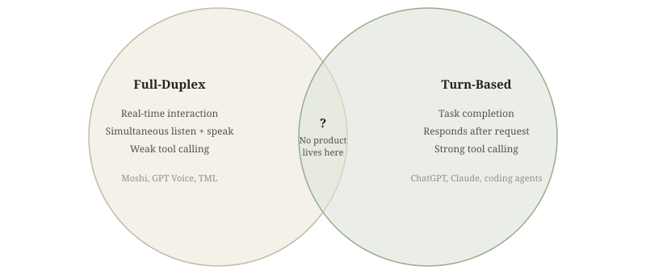
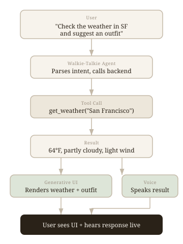

I built a dual-model voice agent and tested it against every Thinking Machines demo. Here's what I found.

## Limits of Mainstream Autonomy Agents {#intro}

Autonomous long horizon coding agents have become the dominant path. More and more companies are building agents that remove humans from the loop entirely, running independently for hours, days, or weeks at a time. It works for a lot of coding problems.

But as I've relied on agents more recently, I've found that full autonomy has its limits. There are many tasks that fall outside of the original training data distribution, and those actually require more human judgment to nudge the agent toward the right decision. Without that nudge, agents sometimes fall into a rabbit hole.

I've started preferring more adaptive agent harnesses. For example, Open Code adapts to user input much more naturally than Claude Code. When I give it direction mid-task, it actually pivots. Claude Code, in comparison, just doesn't listen to me when it's in working mode.

What matters most in those moments is better human-AI collaboration, where agent can pivot with a human in the loop to drive better judgment. There are two paths to get there:

1.  A better model, where collaboration is baked into the model itself. That's what Thinking Machines just shipped.
2.  A more adaptive agent harness, where the scaffolding around the model is designed for real-time human input and collaboration.

## Two Types of LLM Products {#transition}

There are two types of LLM products now. Full-duplex models, where the model is live and can listen and speak simultaneously. Examples include Moshi, GPT voice, and the TML interaction model. These models are optimized for seamless AI and human interaction. Then there are turn-based models, where the bot, agent, or model responds only after the user sends a request. Examples include ChatGPT, Claude, and Gemini, which use a chat format. Coding agents also fall into this category.

These two types are not the same. They have different model architectures, training data, and training targets. Turn-based optimization focuses on completing specific tasks, whereas full-duplex models are designed for real-time interaction. But there is no such good product as a mix of the two, where we get the good interaction from the full-duplex model while also getting the powerful tools from this turn-based model.

<figure class="diagram bare">
        
      </figure>

When Thinking Machines dropped their interaction model, it really put a smile on my face, because finally somebody is trying to build this human-friendly collaborative agent. And then I realized: wait, I already have a similar dual-model setup. Two months ago I built Walkie-Talkie: OpenAI Realtime for frontend interaction, a Claude Code on the backend for tool calling.

        

          
        

        

          <video controls><source src="demos/demo6_weather_ui_outfit.mp4#t=50"></source></video>
        

      

Full-duplex models are optimized for real-time interaction, but they have very weak tool calling capabilities. You can't ask them to generate UI on the fly. I have designed a dual-model setup to make it happen. Here is one example of a generative UI with real-time live interaction. I asked my agent (walkie-talkie) to check the weather, and it renders the weather conditions live with the outfit recommendation.

<figure class="diagram">
        <object type="image/svg+xml" data="diagram_architecture.svg"></object>
        <figcaption>My dual-model setup for Walkie-Talkie. The front-end model handles talking and interacting with the user, while the back-end model handles tool calls, search, and generative UI.</figcaption>
      </figure>

I'm curious how close my setup can get to where they are. Let's test each of their demos and find out.

## Demo 1: Dialog Management {#demo-1}

        

          
Thinking Machines

          

            
            <button class="play-btn"><svg viewbox="0 0 24 24"><polygon points="8,5 19,12 8,19"></polygon></svg></button>
          

        

        

          
Walkie-Talkie

          <video controls><source src="demos/demo1_final_take.mp4"></source></video>
        

      

Count animals while the user is telling a story. (Left) Thinky, (right) my setup of dual models.

Anyone who has used a voice agent before must notice that whenever you take a pause to think, the agent is almost too eager and jump to talk, which makes the entire experience feel very nervous. However, when Lillian interacted with the interaction model, she could even pause to take a sip of water and the model didn't jump in. The entire experience felt very calm and natural.

This simple task is very hard, because it requires at least four things to happen simultaneously:

1.  The model can speak up while the user is still speaking. (Lillian said "deer," and the model immediately counted one. It didn't wait for her to finish the sentence.)
2.  The model understands the difference between taking a pause and finishing talking. (When Lillian stopped to drink water, the model waited. It knew she wasn't done.)
3.  The model listens and performs semantic tagging at the same time. (While following the narrative, it is also judging each word in real time: Deer? Yes. Farm? No. Sheep? Yes. It's doing two things at once.)
4.  The model responds the moment an animal appears. (Every 200 milliseconds, it performs a micro-turn of understanding and decision. That is shorter than human average reaction time of 230ms. This is real-time streaming input.)

I tested it out with my setup, and GPT Realtime counted 1 (deer) right when I said it, that actually surprised me. But it miscounted for 2 (sheep), 3 (coyote), and 4 (capybara). Mainstream voice agents like GPT Realtime and Gemini Live can't do the above 4 things well, because they all rely on VAD (Voice Activity Detection), a dumb gatekeeper that decides whether the user has finished talking. It would only respond when the user finished talking. If your pause exceeds a certain duration, it assumes you're done and responds.

## Demo 2: Verbal/Visual Interjection {#demo-2}

        

          
Thinking Machines

          

            
            <button class="play-btn"><svg viewbox="0 0 24 24"><polygon points="8,5 19,12 8,19"></polygon></svg></button>
          

        

        

          
Walkie-Talkie

          <video controls><source src="demos/demo2_final_take.mp4"></source></video>
        

      

(Left) Visual interjection from Thinky's interaction model. (Right) Verbal interjection from my setup using GPT Realtime.

On the left, the interaction model inspects your sitting pose and interjects when it's off. On the right, I asked GPT Realtime for Tokyo trip recommendations, and while the model was talking, I tried to interject by saying I don't like street food or seafood.

My expectation was it would struggle but it actually adjusted, which surprised me. But it only works when the model can clearly hear me over its own voice. When we're both speaking, my audio collides with the model's. If it doesn't capture my words well, it loses context and can't adjust. If I speak loudly enough and it picks up what I said.

This tells that interjection is a very hard problem. It is essentially simultaneous input and output, an "IO racing" situation. The model has to listen and speak at the same time, and resolve conflicts between the two in real time.

## Demo 3: Simultaneous Speech {#demo-3}

        

          
Thinking Machines

          

            
            <button class="play-btn"><svg viewbox="0 0 24 24"><polygon points="8,5 19,12 8,19"></polygon></svg></button>
          

        

        

          
Walkie-Talkie

          <video controls><source src="demos/demo3_final_take.mp4"></source></video>
        

      

(Left) Simultaneous translation from Thinky's interaction model. (Right) Simultaneous translation from my setup using GPT Realtime.

On the left, the interaction model performs simultaneous translation while the user is still talking. This is super challenging because the model has to manage three tasks simultaneously: (1) Judge when to listen and when to speak (2) Perform context management and chime in (3) Track semantic meaning in real time.

On the right, I used GPT Realtime. It actually does a pretty good job of translating harsh speech into HR-appropriate language. But it depends on my pause. When I work with GPT Realtime, I feel like I have to pause and wait for the model. I am essentially working around its limitations to make the translation happen.

What I learned is that if I prompt it explicitly, "I need you to translate simultaneously," GPT Realtime actually adapts. It doesn't wait for me to finish talking; it speaks while I am still speaking. This means that while you may not achieve full-duplex performance like a true interaction model, you can work around the limitations with specific prompting.

But the difference is clear. For Thinking Machine, the design feels centered around a human. The model has the capability to work in a very interactive way without the user having to adapt. With GPT Realtime, I'm the one adapting to the model.

## Demo 4: Time Awareness {#demo-4}

        

          
Thinking Machines

          

            
            <button class="play-btn"><svg viewbox="0 0 24 24"><polygon points="8,5 19,12 8,19"></polygon></svg></button>
          

        

        

          
Walkie-Talkie

          <video controls><source src="demos/demo4_time_awareness.mp4"></source></video>
        

      

This is a "three things in parallel" task: (1) The model has to set up an alarm using a tool (2) Pay attention to the time checker (3) Answer questions in the trivia game. It is definitely multitasking.

On the left, you can see the interaction model set up a timer and then start to play the game. When the time is up, the model stops talking, which is a perfect collaboration.

On the right, because my setup has the frontend and the backend using Claude Code, it actually has two calling capabilities where it sets up an alarm properly. When we start to play the trivia game, it has time awareness and knows it is supposed to stop playing once the time is up.

However, because the model spills audio, it continues to play the rest of the audio in the buffer. As a result, the model is still playing the trivia game after it says time is up. This reflects that, even though the background model makes the right time judgment, without proper real-time coordination with the front model, we can still fail to fulfill the task.

## Demo 5: Simultaneous Tool Calls, Search, and Generative UI {#demo-5}

        

          
Thinking Machines

          

            
            <button class="play-btn"><svg viewbox="0 0 24 24"><polygon points="8,5 19,12 8,19"></polygon></svg></button>
          

        

        

          
Walkie-Talkie

          <video controls><source src="demos/demo5_final.mp4"></source></video>
        

      

Interaction model draws the Uber latest earning visualization. (Left) Thinky (Right) My setup.

This is one of my favorite demos, showcasing generative UI with simultaneous tool call and search. My setup can do this demo very well.

Walkie Talkie pulls out the latest earnings from Uber and draws a diagram. While the diagram is finishing, the front-end model sees the results and walks through the earnings call plots with me. Super useful for a whiteboarding session in a collaborative mode.

This demo shows the power of tool usage from a backend model. It would be very expensive to train a full duplex model that has very strong tool calling and plotting capabilities. A full-duplex model burns 212 tokens per second, 760K tokens per hour, requires per-session GPU dedication with no batching, and the additive embedding approach (17 tables crammed into 4096 dimensions) has a capacity limit. More tools means more tables, and nobody knows when that breaks. It makes much more sense to have this kind of background model by either:

1.  Stitching it as a background model to use Claude Code
2.  Using a mixture of experts approach, having a dedicated expert in charge of tool calling and plotting the visualization

## Closing {#closing}

Reading through Thinky's interaction model blog, it mentioned that for interactivity to scale with intelligence, it must be part of the model itself. I don't fully agree. Model plus harness becomes a powerful, collaborative agent. These are simply two means to the same end. Interactivity is essentially a type of user experience. As long as we can facilitate and provide this experience, whether we use a full-duplex model or cascaded scaffolding, there is no essential difference for the users.
