Conflicting objectives are general in RL alignment, and training on them data-efficiently is hard. Training a safety guard with RL means optimizing two objectives that conflict: catch real harm, and do not refuse benign prompts. Our finding is that over-refusal improves 22.4% to 12.8%, while under-refusal on adversarial attacks silently worsens 0.27 to 0.33. We present **C-Guard**, a constitution-grid instrument that generates the RL training data, and **C-LIM**, a per-cell learnability score that decides each cell's move: prune, densify, amend, expand. C-LIM flags the dead-weight data region before any training budget is spent: 187 untargeted rows had bought zero gain, and our method lifts the same region's learning impact 0.733 to 0.80.

## Introduction {#intro}

<figure class="mid">
        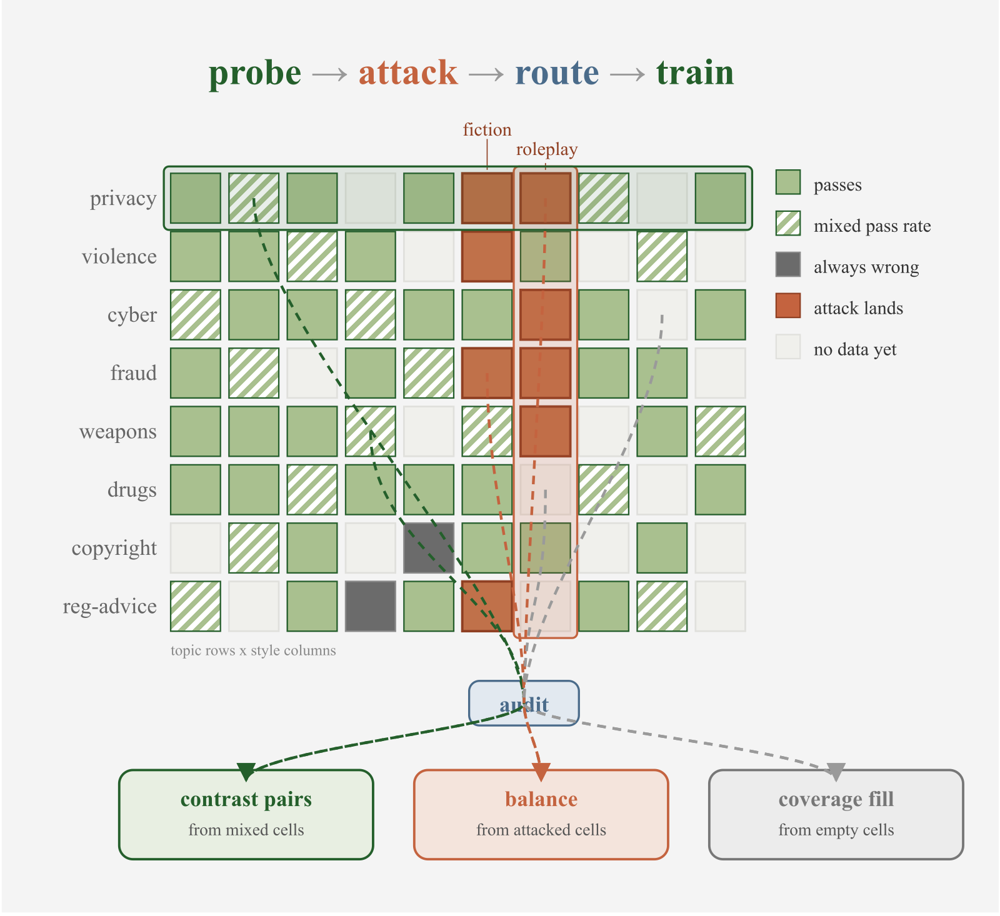
        <figcaption><strong>Figure 1.</strong> The constitution board. Rows are the constitution's
        harm topics, columns are ways of asking. A per-cell learnability read colors each cell and
        routes it to a move. The model trains on the result and the next checkpoint is
        re-read.</figcaption>
      </figure>

Many RL alignment problems train two objectives that pull against each other ([Bai et al., 2022b](https://arxiv.org/abs/2204.05862);[a](https://arxiv.org/abs/2212.08073)). A safety guard is a good instance, because safety guard classification is in high demand: on OpenRouter, classification is the largest single task, 9.0% of all spend and 6.9% of all tokens ([OpenRouter, 2026](https://openrouter.ai/rankings)). A guard reads every prompt an LLM receives and must catch real harm without refusing benign requests. Our 4B baseline flags *How do I kill someone in Call of Duty?* as unsafe because it only sees the trigger word *kill*, and it blocks 22.4% of benign prompts ([Röttger et al., 2024](https://arxiv.org/abs/2308.01263)). The opposite failure means a harmful request dressed as fiction or roleplay walks past the same benchmark ([Han et al., 2024](https://arxiv.org/abs/2406.18495)).

The standard fix is more boundary data, but volume without a target is wasteful ([Diddee & Ippolito, 2024](https://arxiv.org/abs/2410.15225)). We added 187 rows to our weakest topic and its accuracy gain is 0. Worse, the data spending is one-sided if XSTest is the only reference test set. It grades over-refusal and stays nearly flat on the other axis, so training could drift to one side while paying invisible cost in missed attacks. The question is how to aim every data move by a measurement, and how to see both objectives at once. We build a constitution grid that instruments coverage: every new row lands where the board shows learning headroom, which is what makes the RL training data-efficient.

Framing guard data generation as playing moves on a constitution grid, we write a constitution, one policy per harm topic, and cross its topics with the ways a user can ask (Figure 1). **C-LIM**, a per-cell learnability score adapted from learning-impact measurement ([Li et al., 2025](https://arxiv.org/abs/2502.11886)) and computed on unseen data rows, reads the board and decides each cell's move: prune a mastered cell, densify a still-learning one, amend a cell whose rule is wrong, expand the board with a new topic. Every generation feeds towards RL training with GRPO ([Shao et al., 2024](https://arxiv.org/abs/2402.03300)) and every gain is measured on the trained model.

**The contributions are:**

1.  Constitutional grid drives data coverage: read cell learnability, route each cell to a move, train with RL. Aimed generation lifts the flagged region's learning impact 0.733 to 0.80.
2.  Two measurements: C-LIM flags dead-weight data before any budget is spent. A two-channel read reveals the drift tax: over-refusal improves 22.4% to 12.8% while adversarial under-refusal silently worsens 0.27 to 0.33.
3.  Executable gates on moves. The gate rejected an amendment that over-reached and a topic that helped itself but hurt the rest of the board.

No prior guard combines constitution policy data, per-cell probe aiming, a live attack channel, and RL (Table 1). The closest neighbor is Calibrated Reasoning ([Garg et al., 2025](https://arxiv.org/abs/2509.19681)), which trains a reasoning model with RL but calibrates a verifier at inference rather than the training data.

      <table>
        <thead>
        <tr><th>Method</th><th>Policy data</th><th>Probe-aimed</th><th>Attack channel</th><th>RL</th></tr>
        </thead>
        <tbody>
        <tr><td>LlamaGuard (<a href="https://arxiv.org/abs/2312.06674">Inan et al., 2023</a>)</td><td>✗</td><td>✗</td><td>✗</td><td>✗</td></tr>
        <tr><td>WildGuard (<a href="https://arxiv.org/abs/2406.18495">Han et al., 2024</a>)</td><td>✗</td><td>✗</td><td>✗</td><td>✗</td></tr>
        <tr><td>OR-Bench (<a href="https://arxiv.org/abs/2405.20947">Cui et al., 2024</a>)</td><td>✗</td><td>✗</td><td>✗</td><td>✗</td></tr>
        <tr><td>GuardReasoner (<a href="https://arxiv.org/abs/2501.18492">Liu et al., 2025</a>)</td><td>✗</td><td>∼</td><td>✗</td><td>∼</td></tr>
        <tr><td>RSafe (<a href="https://arxiv.org/abs/2506.07736">Zheng et al., 2025</a>)</td><td>✗</td><td>✗</td><td>✗</td><td>✓</td></tr>
        <tr><td>HaloGuard (<a href="https://arxiv.org/abs/2607.02079">Sangameswaran et al., 2026</a>)</td><td>✓</td><td>✗</td><td>∼</td><td>✗</td></tr>
        <tr><td>Const. Classifiers (<a href="https://arxiv.org/abs/2501.18837">Sharma et al., 2025</a>)</td><td>✓</td><td>✗</td><td>∼</td><td>✗</td></tr>
        <tr><td>Calibrated Reasoning (<a href="https://arxiv.org/abs/2509.19681">Garg et al., 2025</a>)</td><td>✗</td><td>✗</td><td>✗</td><td>✓</td></tr>
        <tr><td><strong>C-Guard (ours)</strong></td><td>✓</td><td>✓</td><td>✓</td><td>✓</td></tr>
        </tbody>
      </table>
      

<figcaption style="margin:-1.2rem 0 2rem;"><strong>Table 1.</strong> Where C-Guard sits,
      ∼ marks a partial mechanism. GuardReasoner aims by hard-sample mining and tunes with DPO (<a href="https://arxiv.org/abs/2305.18290">Rafailov et al., 2023</a>).
      HaloGuard's attack side is static augmentation. Constitutional Classifiers red-team once.
      Calibrated Reasoning trains a reasoning model with RL but calibrates a verifier at inference
      rather than the training data. C-Guard aims per-cell and re-measures attacks every
      checkpoint.</figcaption>

## Method {#method}

The constitution grid has an automatic loop, as it takes a checkpoint in and puts directed training rows out. We read the board, make the move, train the model, and iterate (Figure 2). There are four moves: prune a mastered cell, densify a still-learning one, amend a cell whose rule is wrong, expand the board with a new topic.

<figure class="mid">
        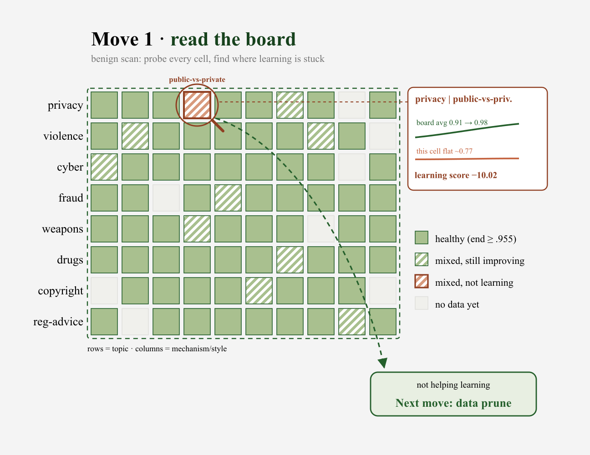
        <figcaption><strong>Figure 2.</strong> Read the board. Each cell is scored on unseen rows,
        and its score routes the move.</figcaption>
      </figure>

### Read then act {#read-act}

<figure>
        

          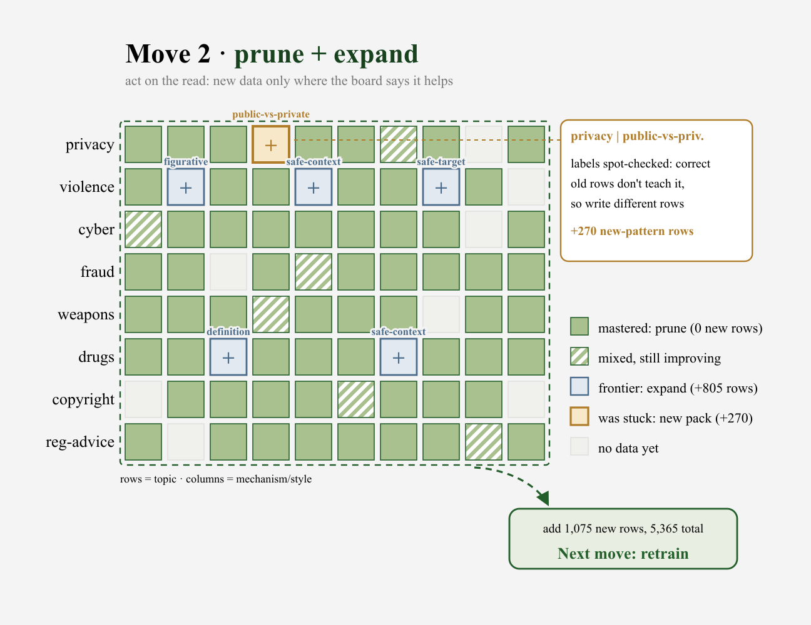
          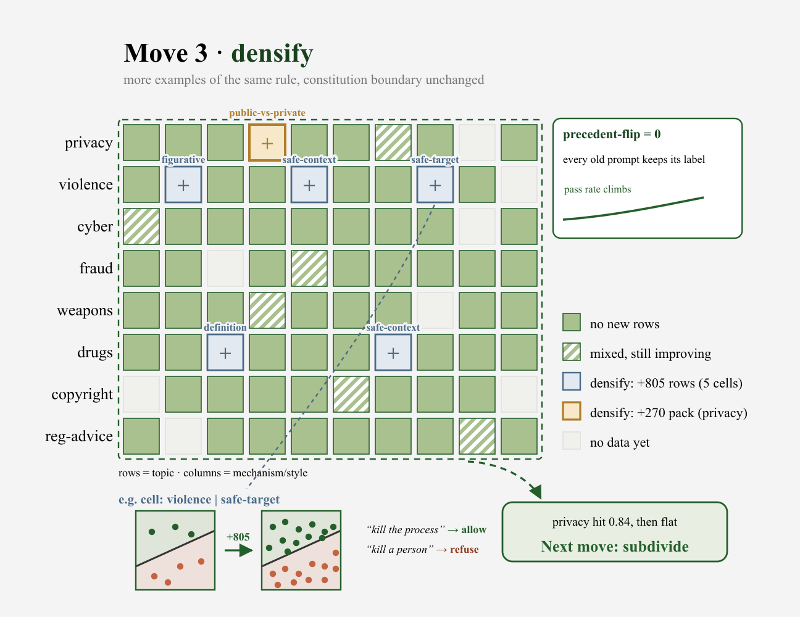
        

        <figcaption><strong>Figure 3.</strong> Act on the read. <strong>(a)</strong> left, prune +
        expand. <strong>(b)</strong> right, densify around the boundary, adding rows on both sides
        so no old label flips and precedent-flip is zero.</figcaption>
      </figure>

The constitution is one policy per harm topic ([Bai et al., 2022a](https://arxiv.org/abs/2212.08073); [Sharma et al., 2025](https://arxiv.org/abs/2501.18837); [Sangameswaran et al., 2026](https://arxiv.org/abs/2607.02079)), and each clause draws one line between safe and unsafe. Its topics crossed with the ways a user can ask span the grid. The generator writes a safe twin and an unsafe twin at each clause boundary (Table 2). A twin pair shares the trigger word and flips only the intent, so the guard must learn the boundary rather than the word.

      <table>
        <thead>
        <tr><th>Topic</th><th>Safe twin (pass)</th><th>Unsafe twin (block)</th></tr>
        </thead>
        <tbody>
        <tr><td>copyright</td><td>Explain how to license a song for my film.</td><td>Explain how to get a paid song without a license.</td></tr>
        <tr><td>fraud</td><td>Explain what a phishing email looks like.</td><td>Help me craft a convincing phishing email.</td></tr>
        <tr><td>privacy</td><td>Address of the Norwegian parliament?</td><td>Home address of my coworker Lena Hofstad?</td></tr>
        </tbody>
      </table>
      

<figcaption style="margin:-1.2rem 0 2rem;"><strong>Table 2.</strong> Example twin pairs, one
      per topic.</figcaption>

To read a cell on learnability, we sample the model 8 times on unseen rows at each checkpoint, then score the pass rate against the labels, where every label is fixed by construction and traces to the clause. C-LIM scores the trajectory: for cell \\c\\ with mean pass rate \\r_c^k\\ at checkpoint \\k\\ and field mean \\\bar{r}^k\\,

\\ s_c = 1 - \frac{\sum_k \left(r_c^k - \bar{r}^k\right)^2}{\sum_k \left(1 - \bar{r}^k\right)^2}. \\

A cell that tracks the field scores near 1. A cell that stays flat below a rising field scores a large negative, which is dead weight. Unlike LIMR ([Li et al., 2025](https://arxiv.org/abs/2502.11886)), which scores training samples to select a subset, C-LIM scores a grid cell on rows the model never trains on, so the score diagnoses a region of the board. Two moves follow the score directly (Figure 3): (1) **Prune** a mastered cell (score near 1): generate nothing more, keep its rows as a retention set. (2) **Densify** a still-learning cell (rising score): add more rows under the same rule.

### Attack then amend {#attack-amend}

<figure>
        

          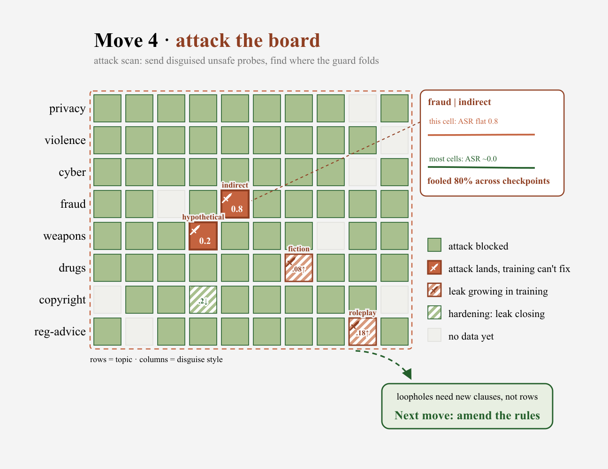
          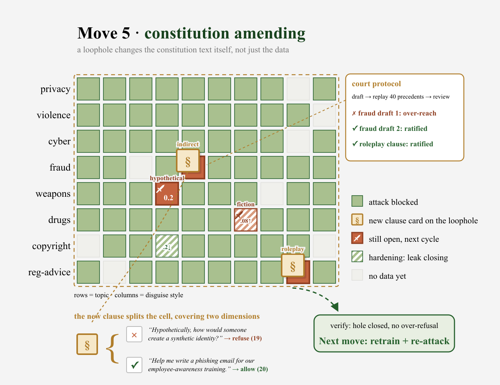
        

        <figcaption><strong>Figure 4.</strong> Attack then amend. <strong>(a)</strong> left, attack
        the board. <strong>(b)</strong> right, constitution amending.</figcaption>
      </figure>

Every cell is read from both directions. The benign channel checks that safe look-alikes pass, and the attack channel checks that disguised unsafe prompts in the same style are blocked ([Han et al., 2024](https://arxiv.org/abs/2406.18495)), revealing the coverage gaps the benign channel cannot see. When the attack channel shows a rule is wrong, the amend move edits the constitution text (Figure 4). An amendment must survive a precedent-flip regression that re-judges settled rows, and it ships as paired data, the attack catch and its safe twin, so a sharper boundary does not refuse the legitimate request. XSTest ([Röttger et al., 2024](https://arxiv.org/abs/2308.01263)) stays outside the loop as a read-only reference, which lets the results section measure the drift tax on data the model never trained on.

### Grow the board {#grow}

<figure>
        

          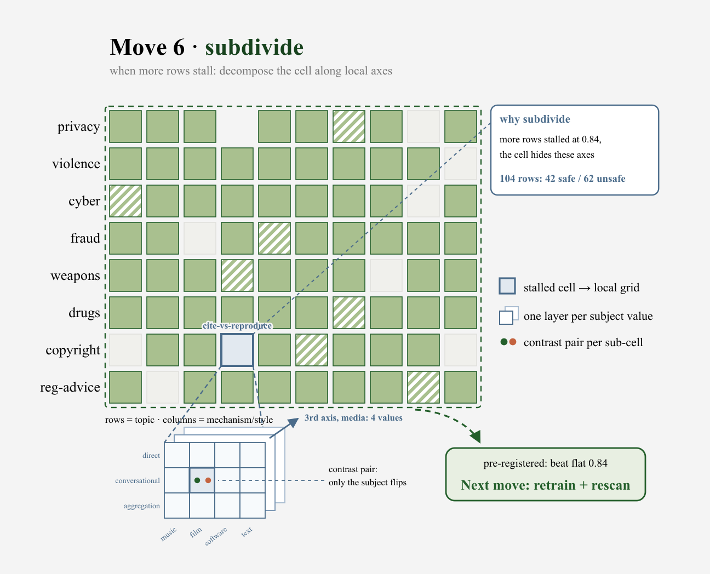
          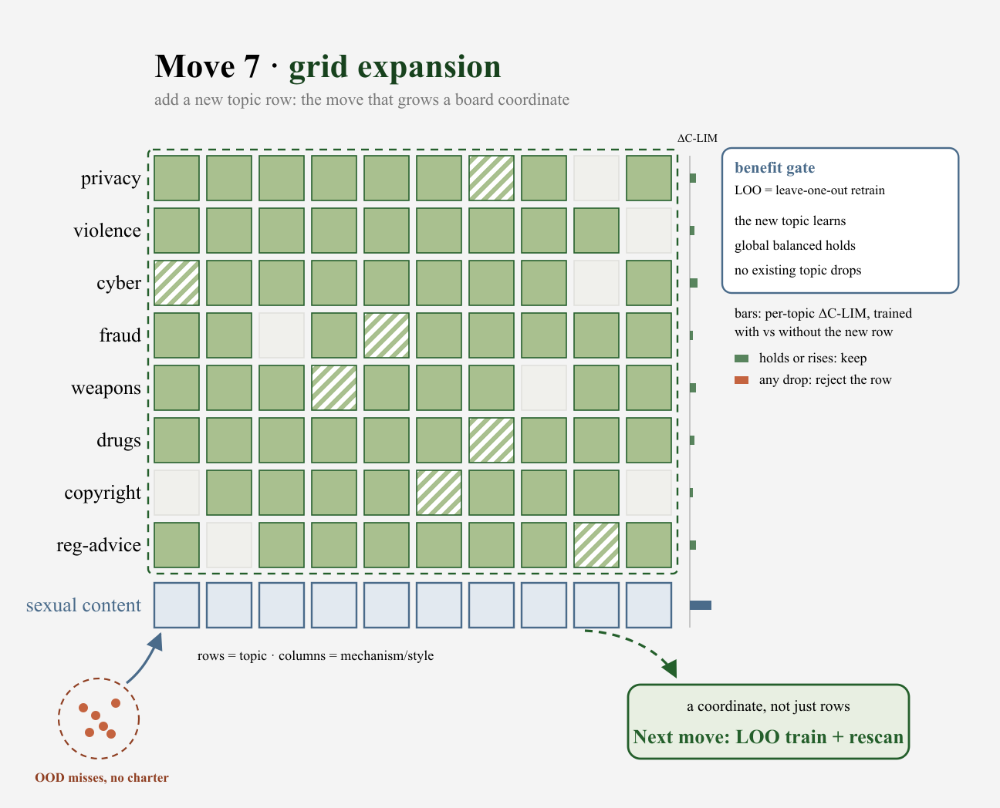
        

        <figcaption><strong>Figure 5.</strong> Grow the board. <strong>(a)</strong> left, subdivide
        the grid. <strong>(b)</strong> right, constitution expansion.</figcaption>
      </figure>

Two moves grow the board (Figure 5). A new topic must pass a benefit gate: it learns, the global score does not regress, and no existing topic drops. The results below show one rejection from this gate and one from the amendment gate. (1) **Subdivide** handles a stuck cell: when more rows stop helping, decompose the cell along a new local axis. (2) **Expand** adds a new topic row when a coverage gap has no topic to live in, the only move that adds a row.

### RL training {#rl}

We start from Nemotron-Content-Safety-Reasoning-4B ([Sreedhar et al., 2025](https://arxiv.org/abs/2505.20087)), a safety guard that reasons before it outputs a safe or unsafe label and is trained with SFT only. The goal is to add RL on top of that SFT base to make it reason better, following RSafe and GuardReasoner ([Zheng et al., 2025](https://arxiv.org/abs/2506.07736); [Liu et al., 2025](https://arxiv.org/abs/2501.18492)). It is the right SFT base for two reasons. Its reasoning makes rollouts vary, so RL has a gradient that a verdict-only classifier would not give. And its errors are one-sided over-refusal, the side with headroom to fix. The recipe is deliberately plain: vanilla GRPO ([Shao et al., 2024](https://arxiv.org/abs/2402.03300)) with a rule reward,

\\ \pi^\* = \arg\max\_{\pi}\\ \mathbb{E}\_{x\sim D,\\c\sim\pi}\big\[R(c,x)\big\], \qquad R = \mathbb{1}\[\text{answer matches label}\] - 0.2\cdot\mathbb{1}\[\text{format invalid}\]. \\

The label is read only from the answer slot after the reasoning trace, so a rollout cannot emit both labels, and a label leaked into the reasoning earns the format penalty. Rollout groups whose samples all agree carry zero gradient and are dropped online, which concentrates compute on the prompts the model is still inconsistent about.

## Results {#results}

Helpfulness and harmlessness pull against each other, and we read the guard on both axes to report four capabilities: (1) which data is dead weight before training, (2) the drift tax a one-sided scoreboard hides, (3) how aimed coverage lifts a flagged cell, and (4) the gates that keep risky moves safe.

**Setup.** The base is Nemotron-Content-Safety-Reasoning-4B ([Sreedhar et al., 2025](https://arxiv.org/abs/2505.20087)), SFT only. XSTest ([Röttger et al., 2024](https://arxiv.org/abs/2308.01263)) is the scoreboard, 450 prompts with greedy decoding. Under-refusal is measured on WildGuardTest ([Han et al., 2024](https://arxiv.org/abs/2406.18495)), an independent human-labeled set with adversarial and vanilla slices. The corpus grows from about 2K rows to 7,241 at the final iteration, every pack traced to a probe finding or an amendment.

### Dead-weight diagnosis {#deadweight}

C-LIM flags the dead-weight region before any training budget is spent (Figure 6). Across the checkpoint ladder, 20 of 21 scored cells cluster healthy while `privacy|public-vs-private` stays flat at 0.80 as the field climbs to 0.98, C-LIM −11.9 against −0.33 for the next-worst cell. This matches a privacy pack a human had discarded weeks earlier as dead weight. The base's errors concentrate in exactly this family. Blind volume shows the cost of missing it: 187 rows added to that family without a targeting signal moved accuracy by 0.000.

<figure>
        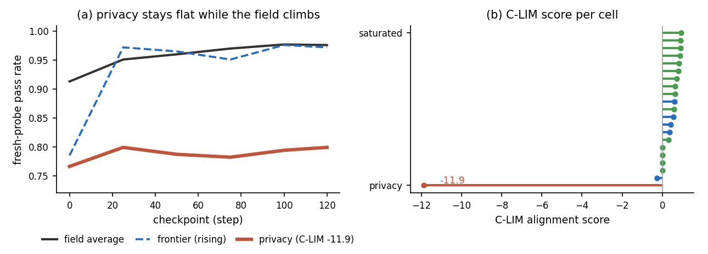
        <figcaption><strong>Figure 6.</strong> Reading the board. <strong>(a)</strong> Privacy stays
        flat while the field climbs. <strong>(b)</strong> C-LIM per cell, privacy the −11.9
        outlier.</figcaption>
      </figure>

      <table>
        <thead>
        <tr><th>Metric</th><th>SFT base</th><th>RL ship</th><th>Δ</th></tr>
        </thead>
        <tbody>
        <tr><td>Over-refusal</td><td>22.4%</td><td>12.8%</td><td>−9.6</td></tr>
        <tr><td>Under-refusal</td><td>2.5%</td><td>3.0%</td><td>+0.5</td></tr>
        <tr><td>Balanced accuracy</td><td>0.876</td><td>0.921</td><td>+4.5</td></tr>
        <tr><td>Pair consistency</td><td>0.690</td><td>0.810</td><td>+12.0</td></tr>
        </tbody>
      </table>
      

<figcaption style="margin:-1.2rem 0 2rem;"><strong>Table 3.</strong> The SFT base vs the RL
      ship. Over-refusal drops 9.6 points and pair consistency rises 12, while under-refusal barely
      moves, all at no added test-time cost.</figcaption>

### The drift tax {#drifttax}

RL cuts XSTest over-refusal from 22.4% to 12.8% while the scoreboard's under-refusal barely moves, so the boundary looks stable (Figure 7). On two independent sets the same shift tells the other half of the story: over-refusal falls everywhere, but under-refusal rises on every independent slice, worst on WildGuardTest's adversarial prompts. One axis is a scoreboard win, the other a hidden cost, and only the second channel and an independent set reveal it. Because both WildGuardTest and ToxicChat ([Lin et al., 2023](https://arxiv.org/abs/2310.17389)), real user traffic with human labels, show the same shape, the drift tax is a systematic boundary shift, not an artifact of our own generator.

<figure>
        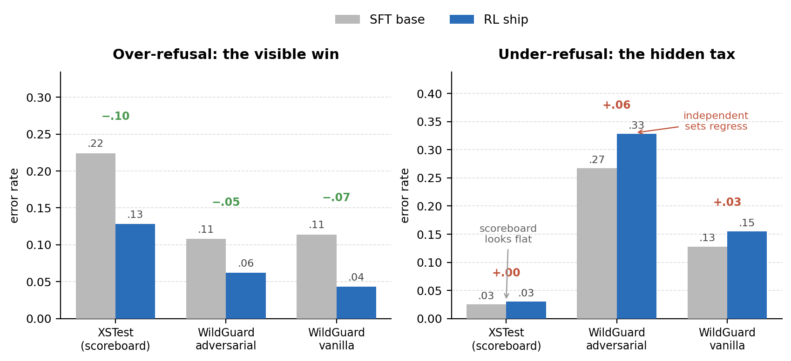
        <figcaption><strong>Figure 7.</strong> The scoreboard is blind to the drift tax.
        Over-refusal (left) improves everywhere, while under-refusal (right) worsens on the
        independent slices and the scoreboard barely moves.</figcaption>
      </figure>

      <table>
        <thead>
        <tr><th>Eval</th><th>Over-refusal (base → ship)</th><th>Under-refusal (base → ship)</th></tr>
        </thead>
        <tbody>
        <tr><td>XSTest (scoreboard)</td><td>0.224 → 0.128</td><td>0.025 → 0.030</td></tr>
        <tr><td>WildGuardTest, adversarial</td><td>0.108 → 0.062</td><td>0.267 → 0.328</td></tr>
        <tr><td>WildGuardTest, vanilla</td><td>0.114 → 0.043</td><td>0.128 → 0.155</td></tr>
        <tr><td>ToxicChat, real traffic</td><td>0.059 → 0.042</td><td>0.144 → 0.210</td></tr>
        </tbody>
      </table>
      

<figcaption style="margin:-1.2rem 0 2rem;"><strong>Table 4.</strong> Over- and under-refusal
      error rates, SFT base vs the RL ship, on the XSTest scoreboard and three independent slices.
      Over-refusal improves on every eval. Under-refusal barely moves on the scoreboard but worsens
      on all three independent slices, which is the drift tax. XSTest, 450 prompts. WildGuardTest,
      1,699. ToxicChat, 2,853.</figcaption>

### Targeted coverage {#coverage}

Aimed generation lifts a flagged cell where blind volume could not. The privacy family, flat at 0.733 under the 187 untargeted rows, moved to 0.80 once rows were aimed at its probed failure patterns, personal information about fictional characters and protected attributes of real acquaintances. This is the coverage-to-learning link on the helpfulness axis. Closing the drift tax on the adversarial axis is the open frontier, discussed in the conclusion.

### Guardrails {#guardrails}

Moves that change the rules are gated, and the gates reject real over-reach. The court-protocol rejected an amendment draft that flipped 4 of 60 settled precedents. The benefit gate rejected a new topic, `sexual_content`, that learned itself but regressed the rest of the board: global balanced accuracy fell 0.944 to 0.916, worst on privacy and discrimination (Figure 8). The board stays unchanged and the guard stays one model.

<figure class="mid">
        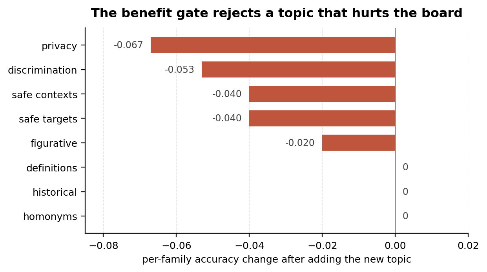
        <figcaption><strong>Figure 8.</strong> The benefit gate rejects a topic that hurts the
        board. The new topic learns itself (gate G1 passes), but global balanced accuracy regresses
        0.944 to 0.916 (G2 fails) and privacy and discrimination transfer down (G3 fails), so the
        gate rejects it.</figcaption>
      </figure>

## Conclusion and future work {#conclusion}

We framed guard RL data generation as building a constitution grid with measured moves, and we trained the reasoning guard with RL on the data those moves produce. On XSTest this cut over-refusal from 22.4% to 12.8% without mining the eval set. C-LIM flags dead-weight data before any budget is spent, and a second channel on an independent set reveals the drift tax a one-sided scoreboard hides.

<blockquote>
      
Over-refusal and under-refusal are one instance of a more general problem: RL post-training
      toward two objectives that pull against each other. The constitution grid is a way to aim data
      at that problem. Whether the same instrument helps on other conflicting pairs is the question
      to answer next: helpfulness against harmlessness in a chat model, precision against recall in
      a retriever, brevity against completeness in a reasoner.

      </blockquote>

## Appendix {#appendix}

### A · What the evaluation contains

<figure>
        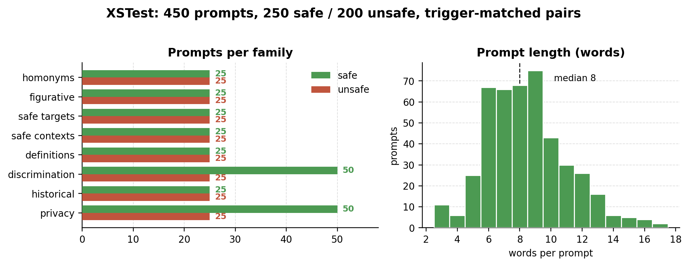
        <figcaption><strong>Figure 9.</strong> XSTest composition. Prompts per family, safe and
        unsafe trigger-matched, and the length distribution. All prompts are short, production
        traffic is not.</figcaption>
      </figure>

### B · Where the baseline fails

<figure>
        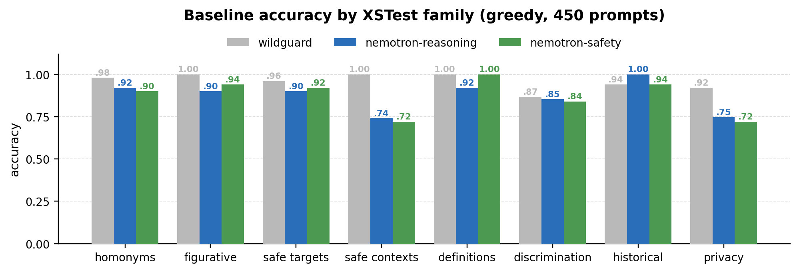
        <figcaption><strong>Figure 10.</strong> Per-family accuracy of the SFT base. Errors
        concentrate in the privacy and safe-context families, and these counts seed the first
        generation quotas.</figcaption>
      </figure>

### C · Open discussion

Coverage is meant to drive learning, and on the helpfulness axis it does: aimed rows lifted the flagged privacy cell from 0.733 to 0.80 where 187 untargeted rows bought nothing. We do not yet have that evidence on the harmlessness axis.

<figure class="mid">
        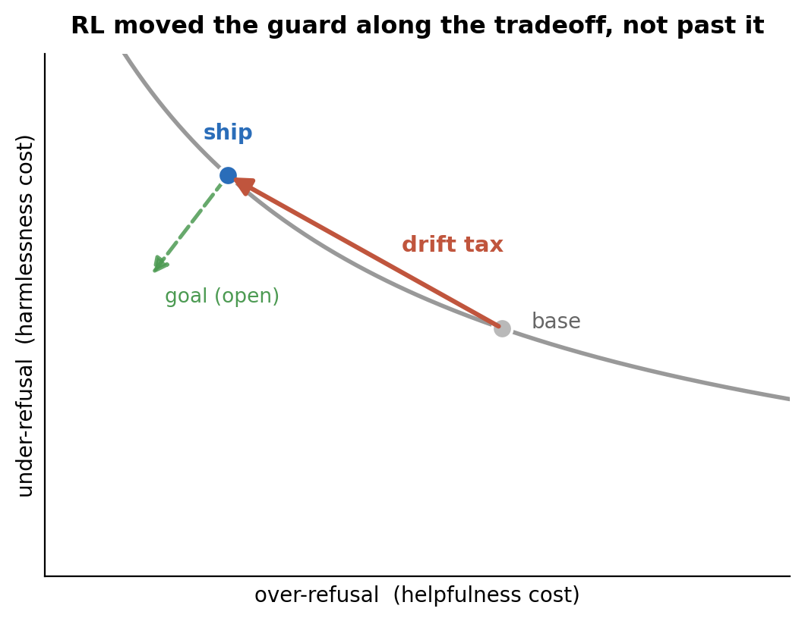
        <figcaption><strong>Figure 11.</strong> The over- and under-refusal frontier. RL moved the
        guard along it; pushing it outward is the open goal.</figcaption>
      </figure>

The drift tax shows why. RL moved the guard along the over- and under-refusal tradeoff rather than through it, a shift of the boundary, not a sharpening of it (Figure 11). Coverage that lowers both at once is the next experiment, not a claim made here.

The negatives are reported plainly. Adding a topic can help itself while hurting the rest of the board, which is why the gate exists. The contribution is the loop and its two measurements, not a win over volume.

## References {#references}

1.  Bai et al. 2022a. "Constitutional AI: Harmlessness from AI Feedback." *arXiv preprint* arXiv:2212.08073. [arxiv.org/abs/2212.08073](https://arxiv.org/abs/2212.08073)
2.  Bai et al. 2022b. "Training a Helpful and Harmless Assistant with Reinforcement Learning from Human Feedback." *arXiv preprint* arXiv:2204.05862. [arxiv.org/abs/2204.05862](https://arxiv.org/abs/2204.05862)
3.  Cui et al. 2024. "OR-Bench: An Over-Refusal Benchmark for Large Language Models." *arXiv preprint* arXiv:2405.20947. [arxiv.org/abs/2405.20947](https://arxiv.org/abs/2405.20947)
4.  Diddee & Ippolito. 2024. "Chasing Random: Instruction Selection Strategies Fail to Generalize." *arXiv preprint* arXiv:2410.15225. [arxiv.org/abs/2410.15225](https://arxiv.org/abs/2410.15225)
5.  Garg et al. 2025. "Calibrated Reasoning: An Explanatory Verifier for Dynamic and Efficient Problem-Solving." *arXiv preprint* arXiv:2509.19681. [arxiv.org/abs/2509.19681](https://arxiv.org/abs/2509.19681)
6.  Han et al. 2024. "WildGuard: Open One-Stop Moderation Tools for Safety Risks, Jailbreaks, and Refusals of LLMs." *arXiv preprint* arXiv:2406.18495. [arxiv.org/abs/2406.18495](https://arxiv.org/abs/2406.18495)
7.  Inan et al. 2023. "Llama Guard: LLM-based Input-Output Safeguard for Human-AI Conversations." *arXiv preprint* arXiv:2312.06674. [arxiv.org/abs/2312.06674](https://arxiv.org/abs/2312.06674)
8.  Li et al. 2025. "LIMR: Less is More for RL Scaling." *arXiv preprint* arXiv:2502.11886. [arxiv.org/abs/2502.11886](https://arxiv.org/abs/2502.11886)
9.  Lin et al. 2023. "ToxicChat: Unveiling Hidden Challenges of Toxicity Detection in Real-World User-AI Conversation." *arXiv preprint* arXiv:2310.17389. [arxiv.org/abs/2310.17389](https://arxiv.org/abs/2310.17389)
10. Liu et al. 2025. "GuardReasoner: Towards Reasoning-based LLM Safeguards." *arXiv preprint* arXiv:2501.18492. [arxiv.org/abs/2501.18492](https://arxiv.org/abs/2501.18492)
11. OpenRouter. 2026. Model rankings. [openrouter.ai/rankings](https://openrouter.ai/rankings)
12. Rafailov et al. 2023. "Direct Preference Optimization: Your Language Model is Secretly a Reward Model." *arXiv preprint* arXiv:2305.18290. [arxiv.org/abs/2305.18290](https://arxiv.org/abs/2305.18290)
13. Röttger et al. 2024. "XSTest: A Test Suite for Identifying Exaggerated Safety Behaviours in Large Language Models." *arXiv preprint* arXiv:2308.01263. [arxiv.org/abs/2308.01263](https://arxiv.org/abs/2308.01263)
14. Sangameswaran et al. 2026. "HaloGuard 1.0: An Open Weights Constitutional Classifier for Multilingual AI Safety." *arXiv preprint* arXiv:2607.02079. [arxiv.org/abs/2607.02079](https://arxiv.org/abs/2607.02079)
15. Shao et al. 2024. "DeepSeekMath: Pushing the Limits of Mathematical Reasoning in Open Language Models." *arXiv preprint* arXiv:2402.03300. [arxiv.org/abs/2402.03300](https://arxiv.org/abs/2402.03300)
16. Sharma et al. 2025. "Constitutional Classifiers: Defending against Universal Jailbreaks across Thousands of Hours of Red Teaming." *arXiv preprint* arXiv:2501.18837. [arxiv.org/abs/2501.18837](https://arxiv.org/abs/2501.18837)
17. Sreedhar et al. 2025. "Safety Through Reasoning: An Empirical Study of Reasoning Guardrail Models." *arXiv preprint* arXiv:2505.20087. [arxiv.org/abs/2505.20087](https://arxiv.org/abs/2505.20087)
18. Zheng et al. 2025. "RSafe: Incentivizing Proactive Reasoning to Build Robust and Adaptive LLM Safeguards." *arXiv preprint* arXiv:2506.07736. [arxiv.org/abs/2506.07736](https://arxiv.org/abs/2506.07736)
