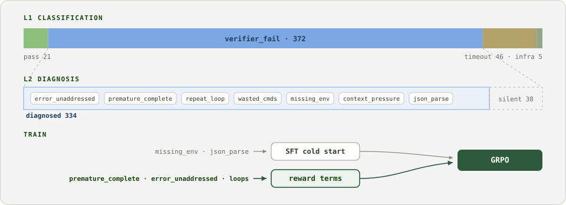
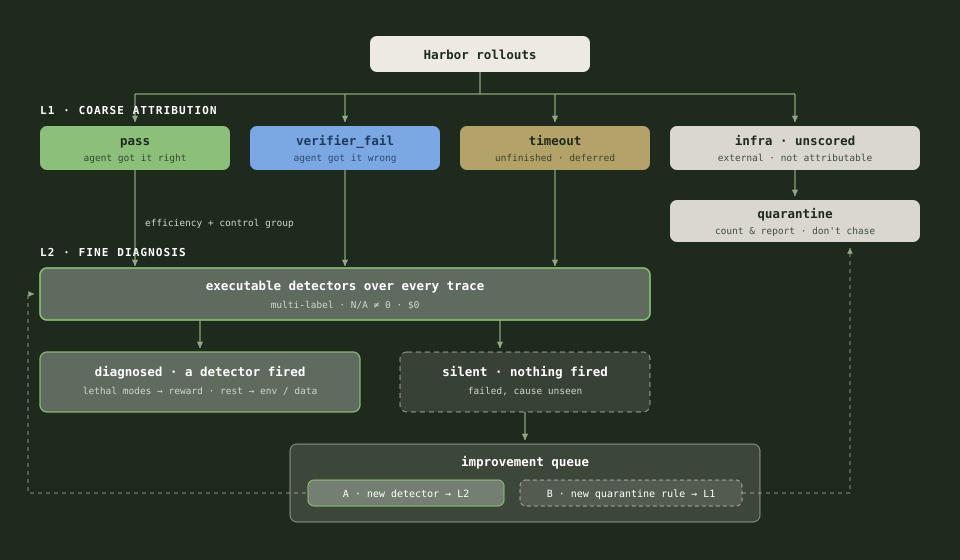
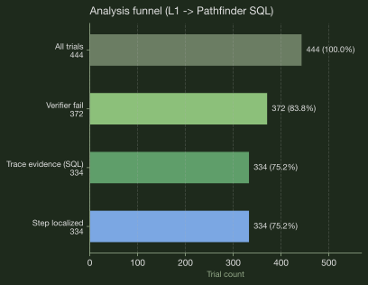
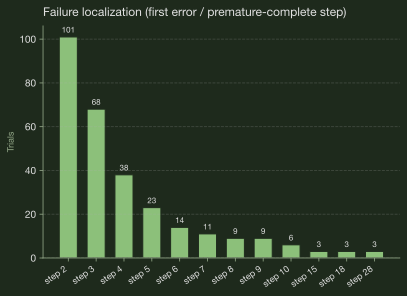
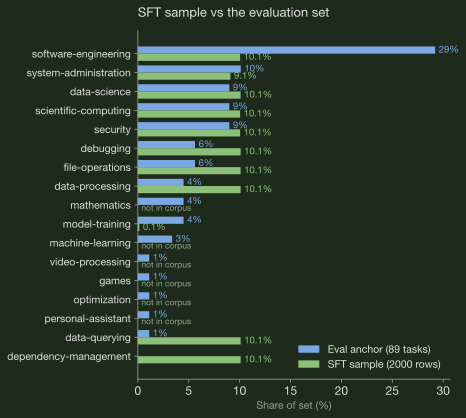

# Harbor RLVR environment — figures

Figures from [harbor-rlvr-environment.md](./harbor-rlvr-environment.md) / [lilyzh.ng/posts/harbor-rlvr-environment](https://lilyzh.ng/writing/harbor-rlvr-environment/). Captions are copied verbatim from the published figcaptions. Relative paths so a normal markdown preview renders them.

**Paper-plot triage** (compact + informative enough for `/paper-plot`):

| Fig | File | Verdict |
|---|---|---|
| 1 | `tb2-teaser-v9-light.svg` (prefer light) / `tb2-teaser-v8.svg` (blog dark) | **Yes, after restyle** — method overview; light variant is closer to paper |
| 2 | `tb2-taxonomy-v2-design.svg` | **Maybe** — informative system diagram, too tall/busy for single-column without cutting labels |
| 3 | `tb2-taxonomy-fig-1.svg` | **Yes** — compact L1 mix; primary problem setup |
| 4 | `tb2-taxonomy-fig-2.svg` | **Yes** — silent-trial funnel; design rule in one glance |
| 5 | `tb2-taxonomy-fig-3.svg` | **Yes (best data chart)** — reward-design headline |
| 6 | `tb2-taxonomy-fig-4.svg` | **Yes** — early-step cluster; justifies `MAX_TURNS` |
| 7 | `tb2-data-fig-corpus-vs-sample.svg` | **No for paper bootstrap** — data-prep detail; keep as design-plot |
| 8 | `tb2-data-fig-sample-vs-eval.svg` | **No for paper bootstrap** — busy category compare; appendix/blog only |

Note: figs 3–6 are currently dark Solarized (blog). Paper use means white canvas + pastel/ink restyle via `/paper-plot from-design`.

---

## Figure 1 — Method pipeline

**Figure 1:** The pipeline. Classify what happened (L1), diagnose why (L2), then split by failure type: knowledge gaps go to SFT, decision failures become reward terms for GRPO.

---

## Figure 2 — Taxonomy as a system

**Figure 2:** The taxonomy as a system. L1 does coarse attribution (who is responsible) and quarantines what can't be attributed; L2 runs the executable detectors over every attributable trace, pass included (passes are the control group for the failure modes). Every silent trial exits the improvement queue one of two ways: A, a failure we have no detector for, so we build one and L2 grows; or B, the task or verifier itself is broken, so we add a quarantine rule and L1 grows.

---

## Figure 3 — Harbor L1 outcomes

**Figure 3:** Harbor L1 outcomes. Mostly `verifier_fail` (~84%), not timeout. The learning problem is **how** the agent fails the verifier.

---

## Figure 4 — Analysis funnel

**Figure 4:** Analysis funnel. 38 silent trials: verifier failed but no ATIF signal for a mode penalty. Design rule: only penalize computed trace evidence.

---

## Figure 5 — Executable failure modes

**Figure 5:** Executable failure modes. Primary chart for reward design. Headline: the missing-reflection family (`premature_complete` + `error_unaddressed`) fires 434+ times across multi-label trials.

---

## Figure 6 — Failure step distribution

**Figure 6:** Failure step distribution. First failures cluster at steps 2–3, not the turn cap. Bottleneck is wasted actions early, not horizon length.

---

## Figure 7 — Corpus vs balanced sample

**Figure 7:** Source corpus vs the first-round sample: each of the 11 categories gets an equal share.

---

## Figure 8 — Sample vs eval anchor

**Figure 8:** The same sample vs the eval anchor. Six eval categories do not exist in the corpus at all; model-training survives the quality gates with only 3 rows.
