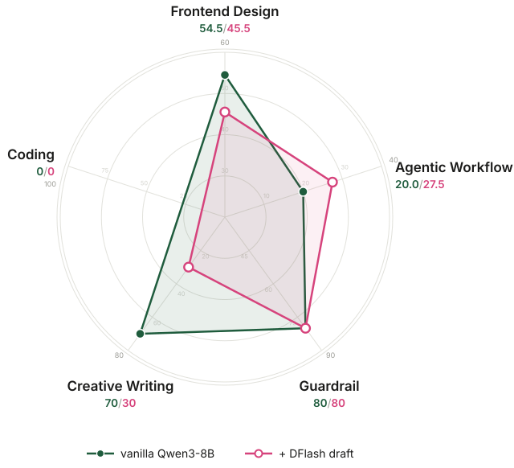
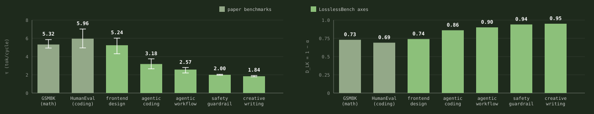

Speculative decoding is lossless in theory: the verified output follows the target model's distribution. The papers, including <a href="https://arxiv.org/abs/2503.01840">EAGLE-3</a>, <a href="https://arxiv.org/abs/2602.06036">DFlash</a>, <a href="https://arxiv.org/abs/2607.05147">DeepSeek DSpark</a>, and <a href="https://inco.ai/blog/dflash2/">DFlash 2</a>, only validate on easy-to-measure domains such as math and function-level coding, a narrow slice of what models are asked to do in practice. To measure speculative decoding and inference acceleration on domains beyond coding and math, we built LosslessBench.

<figure class="diagram bare">

<figcaption>Figure 1. Qwen3-8B with vs without speculative decoding on LosslessBench. Axes are independently scaled, so each domain's relative gap is visible.</figcaption></figure>

With the DFlash draft, frontend design drops from 54.5 to 45.5 and creative writing from 70 to 30. Guardrail holds at 80. Agentic workflow rises from 20.0 to 27.5. Both runs use the same Qwen3-8B with the same distribution, so the gain comes from the path each run happened to take. Under greedy decoding a small numerical difference flips one token; in an agent loop that flip can become an extra tool call, whose result changes every later turn. Across the ten tau3 retail tasks the accelerated run took that branch more often: it thinks longer (416 vs 261 words per thinking turn) and calls more tools (76 vs 54), and the extra tool results carry it to the higher score.

## Five domains {#domains}

**[LosslessBench](https://huggingface.co/datasets/lilyzhng/lossless_bench)** evaluates across five domains: coding, agent workflows, creative writing, guardrails, and frontend design. Each axis in Figure 1 uses its domain's own benchmark and metric:

- **Frontend**: OpenDesign. Each page is judged twice: a GPT-4o vision judge scores the rendered screenshot on alignment, aesthetics, and structure, and a browser agent clicks every component to score whether the page actually works.
- **Creative**: EQ-Bench longform score, judged over multi-chapter creative writing.
- **Guardrail**: XSTest, classification accuracy on safe vs unsafe prompts built to sit near the decision boundary.
- **Coding**: Terminal-Bench pass rate.
- **Agent workflow**: tau3-bench long-horizon agent tasks, action match rate.

## Acceptance length as a divergence probe {#acceptance}

A reported acceptance length is an implicit token-level divergence measurement, which makes it a natural probe for the five new domains. As a sanity check, our harness reproduces DFlash's published numbers on its own benchmarks: 5.32 vs. their 5.98 on GSM8K, and 5.96 vs. their 5.52 on HumanEval. Across the five LosslessBench axes, acceptance falls from 5.24 to 1.84. The draft drifts furthest on the domains the papers never measured. Frontend design is an exception: its acceptance stays high while the generated pages break (Figure 3), because acceptance measures draft and target agreement, not output quality. Whether the divergence translates into task-level quality loss is what Figure 1 examines.

<figure class="diagram bare"><figcaption>Figure 2. DFlash acceptance length by domain (left) and the implied distributional divergence D_LK = 1 − α (right). Lower acceptance means larger token-level divergence.</figcaption></figure>

## Explore the evaluation by yourself {#explore}

Pick any domain and open the side-by-side outputs:

<a href="demo/compare_frontend.html" target="_blank" style="padding:7px 18px;border:1.5px solid #1f5c3d;border-radius:999px;text-decoration:none;color:#1f5c3d;font-weight:600;">Frontend Design</a>
<a href="demo/compare_taubench.html" target="_blank" style="padding:7px 18px;border:1.5px solid #1f5c3d;border-radius:999px;text-decoration:none;color:#1f5c3d;font-weight:600;">Agentic Workflow</a>
<a href="demo/compare_guardrail.html" target="_blank" style="padding:7px 18px;border:1.5px solid #1f5c3d;border-radius:999px;text-decoration:none;color:#1f5c3d;font-weight:600;">Safety Guardrail</a>
<a href="demo/compare_creative.html" target="_blank" style="padding:7px 18px;border:1.5px solid #1f5c3d;border-radius:999px;text-decoration:none;color:#1f5c3d;font-weight:600;">Creative Writing</a>
<a href="demo/compare_coding.html" target="_blank" style="padding:7px 18px;border:1.5px solid #1f5c3d;border-radius:999px;text-decoration:none;color:#1f5c3d;font-weight:600;">Agentic Coding</a>

<figure class="diagram bare"><iframe src="demo/race_demo.html" style="width:100%;height:720px;border:1px solid #ddd;border-radius:10px;" loading="lazy" title="Live decoding race on the calendar brief"></iframe><figcaption>Figure 3. The decoding race on the LosslessBench calendar brief (L101). Vanilla takes 18.7s, DFlash 8.9s. DFlash is the fastest, and its page is the broken one.</figcaption></figure>

Look closely at Figure 3: the four models did not generate the same page, or even the same number of tokens. Vanilla produced 2,683 tokens on the calendar brief, the accelerated models between 2,606 and 3,048. DFlash decoded fastest per token (341 vs 143 tok/s), and its calendar came out visibly broken.

<figure class="diagram bare"><iframe src="demo/creative_race_demo.html" style="width:100%;height:720px;border:1px solid #ddd;border-radius:10px;" loading="lazy" title="Live decoding race on the creative brief"></iframe><figcaption>Figure 4. The same race on a 1000-word creative brief (LosslessBench L073). Vanilla takes 15.2s, DFlash 8.5s.</figcaption></figure>

Figure 4 is the evaluation result on the creative writing task: EAGLE-3 and DSpark wrote identical stories, while vanilla and DFlash each took a different trajectory from the same opening line. That leaves three distinct stories to judge:

| story | instruction following | Latin vocabulary | writing style |
|---|---|---|---|
| vanilla · 7/10 | 979 words. Ends entering the fight, close to violating the no-combat rule. | Correct, restrained. | Strongest sensory detail. Named cast. Ending falls back on a generic freedom monologue. |
| EAGLE-3 / DSpark · 6/10 | Best. 998 words, all constraints met. | Correct, sparse. | Weakest as fiction. Restates one thesis three times. No named characters. Explains politics rather than dramatizing it. |
| DFlash · 7.5/10 | Worst. 1,092 words, 9% over. Invents a sacrae bell. | Inaccurate, decorative. | Best structure. Full dawn-to-night arc, one side character with a backstory, strongest closing image. |

**Table 1.** The three distinct gladiator stories, judged on the brief's own constraints. Same target model, greedy decoding: the differences are trajectory divergence, not different models.

Overall, DFlash wins. Fiction lives on shape and character before compliance, and DFlash is the only story that delivers a complete day, a side character you remember, and a closing image that lands. Its violations are copyedit-level fixes. EAGLE-3 and DSpark followed every rule and produced the piece you forget first.

Interestingly, DFlash wrote the worst calendar page but the best story. Why do EAGLE-3 and DSpark match in writing and front end code, while DFlash stands apart? EAGLE-3 and DSpark share DeepSpec's training data, propose similar tokens. DFlash differs in training data, block size, and serving path, so the exact cause cannot be ruled out here, but likely caused by the difference in training data.

## What's next for LosslessBench {#next}

- Full K3 evaluation across all five domains.
- A controlled run: serve the model myself and toggle one acceleration at a time, so I can tell which one costs quality.
- Measure token distribution shift: compare each token's probability against the reference.
- Watch the acceptance rate: if a vendor relaxes the acceptance rule, acceptance goes up and quality drifts.
- Make LosslessBench efficient enough to run as part of CI, catching regressions on every inference stack change.

Dataset: <a href="https://huggingface.co/datasets/lilyzhng/lossless_bench">lilyzhng/lossless_bench</a>.

