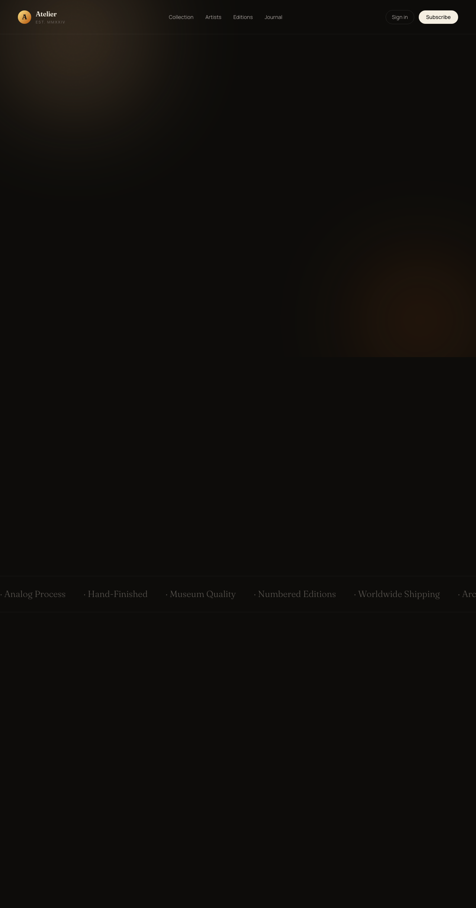
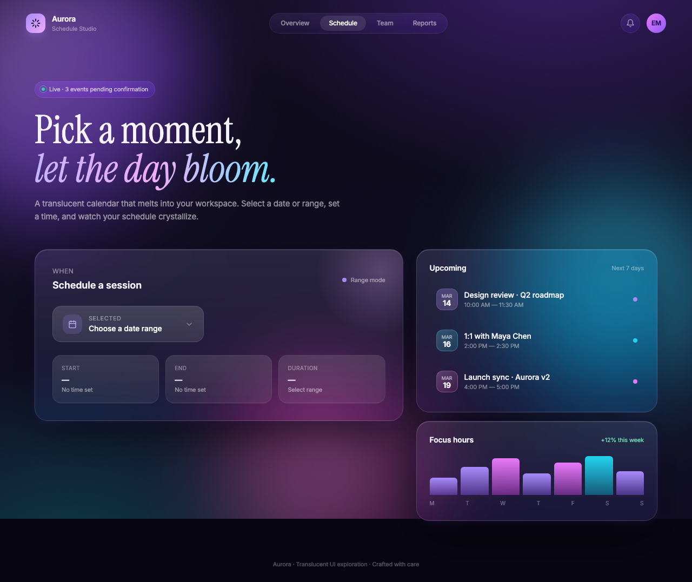

Every inference provider is racing to make open models faster. Nobody measures what the speedup costs. So I built LosslessBench, a benchmark across five domains, and ran GLM 5.2 and Kimi K3 through it. See Figure 1: both pages came from GLM 5.2, same prompt. The left was served by Z.AI at fp8, the right through Baseten's accelerated fp4 + spec endpoint. This is what inference acceleration can cost.

<figure class="diagram bare">
        

          

            
fp8 (Z.AI) · score 93

            

              
            

          

          

            
fp4 (Baseten) · score 15

            

              
            

          

        

        <figcaption>Figure 1. Left: fp8 implements the photo card with the 3D flip. Right: fp4 renders a near-blank page.</figcaption>
      </figure>

The judge evaluates each rendered page on whether it fulfills the prompt: a photo card interface with a 3D flip on hover. fp8 built it, scored 93, and the judge wrote "excellently implements the 3D flip effect." fp4, in contrast, produced a page with no flip effect and no photo card at all, scored 15, and the judge wrote "fails to meet the prompt's requirements." fp4 model skipped the prompt requirement entirely.

Zoom out, **Whoever handles inference acceleration owns the quality loss.** GLM 5.2, accelerated by its vendors, loses 5.6 points on frontend design. Kimi K3, which owns its own acceleration, loses 0.3.

<figure class="diagram bare">
<svg viewbox="40 10 640 240" width="100%" xmlns="http://www.w3.org/2000/svg" role="img" aria-label="Quality loss comparison. GLM 5.2 with vendor-owned acceleration loses 5.6 points. Kimi K3 with model-owned acceleration loses 0.3 points.">
  <line x1="120" y1="60" x2="120" y2="260" stroke="#e7e7e2" stroke-width="1"></line>
  <line x1="120" y1="60" x2="640" y2="60" stroke="#e7e7e2" stroke-width="1"></line>
  <text x="112" y="64" text-anchor="end" font-family="Inter,system-ui,sans-serif" font-size="12" fill="#8a8a84">0</text>
  <rect x="120" y="60" width="470" height="70" fill="#d6437c" fill-opacity="0.14"></rect>
  <rect x="120" y="60" width="470" height="70" fill="none"></rect>
  <rect x="120" y="74" width="470" height="42" fill="#d6437c"></rect>
  <text x="600" y="101" font-family="Inter,system-ui,sans-serif" font-size="17" font-weight="700" fill="#d6437c">−5.6</text>
  <text x="120" y="46" font-family="Inter,system-ui,sans-serif" font-size="15.5" font-weight="600" fill="#1a1a19">GLM 5.2, acceleration owned by the vendor</text>
  <rect x="120" y="188" width="25" height="42" fill="#1f5c3d"></rect>
  <text x="155" y="215" font-family="Inter,system-ui,sans-serif" font-size="17" font-weight="700" fill="#1f5c3d">−0.3</text>
  <text x="120" y="172" font-family="Inter,system-ui,sans-serif" font-size="15.5" font-weight="600" fill="#1a1a19">Kimi K3, acceleration owned by the model</text>
</svg>
<figcaption>Figure 2. Frontend quality loss under acceleration: vendor-owned vs model-owned.</figcaption></figure>

## Digging into Inference Quality Loss on GLM 5.2 {#glm}

Philip and Baseten have been incredibly transparent about their inference stack. When I asked what the Baseten GLM 5.2 endpoint actually runs, he answered in one line.

<blockquote class="twitter-tweet" data-dnt="true">
NVFP4 + spec dec + kv routing + pd disagg + more
— @philipkiely <a href="https://x.com/philipkiely/status/2072309083617853535">source</a></blockquote>

I built a benchmark called LosslessBench. It measures how much quality is lost between the model a lab releases, the endpoint an inference provider serves, and what the application layer receives.

It's the same GLM 5.2, just served differently:

- **Z.AI**: fp8, the release precision
- **Baseten**: NVFP4 + spec dec + kv routing + pd disagg

The domains are driven by [OpenRouter token usage statistics](https://openrouter.ai/rankings) across tasks. LosslessBench measures how inference loss impacts the majority of customers.

<figure class="diagram bare">
<svg viewbox="180 38 640 538.05" width="100%" xmlns="http://www.w3.org/2000/svg" role="img" aria-label="Radar chart, GLM 5.2 fp8 vs fp4 across five domains, per-axis relative scale. Frontend design dents from 76.9 to 71.2.">
<polygon points="460.0,207.8 547.7,271.5 514.2,374.6 405.8,374.6 372.3,271.5" fill="none" stroke="#e2e2dc" stroke-width="1"></polygon><polygon points="460.0,156.5 596.5,255.7 544.3,416.1 375.7,416.1 323.5,255.7" fill="none" stroke="#e2e2dc" stroke-width="1"></polygon><polygon points="460.0,105.2 645.2,239.8 574.5,457.6 345.5,457.6 274.8,239.8" fill="none" stroke="#e2e2dc" stroke-width="1"></polygon><line x1="460" y1="300" x2="460.0" y2="95.0" stroke="#e2e2dc" stroke-width="1"></line><line x1="460" y1="300" x2="655.0" y2="236.7" stroke="#e2e2dc" stroke-width="1"></line><line x1="460" y1="300" x2="580.5" y2="465.8" stroke="#e2e2dc" stroke-width="1"></line><line x1="460" y1="300" x2="339.5" y2="465.8" stroke="#e2e2dc" stroke-width="1"></line><line x1="460" y1="300" x2="265.0" y2="236.7" stroke="#e2e2dc" stroke-width="1"></line><polygon points="460.0,135.6 573.5,263.1 547.1,419.9 377.6,413.4 323.5,255.7" fill="#1f5c3d" fill-opacity="0.10" stroke="#1f5c3d" stroke-width="2.5"></polygon><polygon points="460.0,177.4 619.5,248.2 541.5,412.2 373.7,418.8 323.5,255.7" fill="#d6437c" fill-opacity="0.08" stroke="#d6437c" stroke-width="2.5"></polygon><circle cx="460.0" cy="135.6" r="5.5" fill="#1f5c3d" stroke="#fff" stroke-width="1.5"></circle><circle cx="573.5" cy="263.1" r="5.5" fill="#1f5c3d" stroke="#fff" stroke-width="1.5"></circle><circle cx="547.1" cy="419.9" r="5.5" fill="#1f5c3d" stroke="#fff" stroke-width="1.5"></circle><circle cx="377.6" cy="413.4" r="5.5" fill="#1f5c3d" stroke="#fff" stroke-width="1.5"></circle><circle cx="323.5" cy="255.7" r="5.5" fill="#1f5c3d" stroke="#fff" stroke-width="1.5"></circle><circle cx="460.0" cy="177.4" r="5.5" fill="#fff" stroke="#d6437c" stroke-width="2.4"></circle><circle cx="619.5" cy="248.2" r="5.5" fill="#fff" stroke="#d6437c" stroke-width="2.4"></circle><circle cx="541.5" cy="412.2" r="5.5" fill="#fff" stroke="#d6437c" stroke-width="2.4"></circle><circle cx="373.7" cy="418.8" r="5.5" fill="#fff" stroke="#d6437c" stroke-width="2.4"></circle><circle cx="323.5" cy="255.7" r="5.5" fill="#fff" stroke="#d6437c" stroke-width="2.4"></circle><text x="460" y="65" text-anchor="middle" font-family="Inter,system-ui,sans-serif" font-size="17" font-weight="600" fill="#1a1a19">Frontend Design</text><text x="460" y="85" text-anchor="middle" font-family="Inter,system-ui,sans-serif" font-size="13.5"><tspan fill="#1f5c3d" font-weight="600">76.9</tspan><tspan fill="#9a9a94"> / </tspan><tspan fill="#d6437c" font-weight="600">71.2</tspan></text><text x="665" y="235" text-anchor="start" font-family="Inter,system-ui,sans-serif" font-size="17" font-weight="600" fill="#1a1a19">Agent Workflow</text><text x="665" y="255" text-anchor="start" font-family="Inter,system-ui,sans-serif" font-size="13.5"><tspan fill="#1f5c3d" font-weight="600">26.7</tspan><tspan fill="#9a9a94"> / </tspan><tspan fill="#d6437c" font-weight="600">33.3</tspan></text><text x="580" y="488" text-anchor="middle" font-family="Inter,system-ui,sans-serif" font-size="17" font-weight="600" fill="#1a1a19">Creative Writing</text><text x="580" y="508" text-anchor="middle" font-family="Inter,system-ui,sans-serif" font-size="13.5"><tspan fill="#1f5c3d" font-weight="600">83.5</tspan><tspan fill="#9a9a94"> / </tspan><tspan fill="#d6437c" font-weight="600">82.2</tspan></text><text x="340" y="488" text-anchor="middle" font-family="Inter,system-ui,sans-serif" font-size="17" font-weight="600" fill="#1a1a19">Guardrail</text><text x="340" y="508" text-anchor="middle" font-family="Inter,system-ui,sans-serif" font-size="13.5"><tspan fill="#1f5c3d" font-weight="600">95.7</tspan><tspan fill="#9a9a94"> / </tspan><tspan fill="#d6437c" font-weight="600">96.6</tspan></text><text x="255" y="235" text-anchor="end" font-family="Inter,system-ui,sans-serif" font-size="17" font-weight="600" fill="#1a1a19">Coding</text><text x="255" y="255" text-anchor="end" font-family="Inter,system-ui,sans-serif" font-size="13.5"><tspan fill="#1f5c3d" font-weight="600">80</tspan><tspan fill="#9a9a94"> / </tspan><tspan fill="#d6437c" font-weight="600">80</tspan></text><g font-family="Inter,system-ui,sans-serif" font-size="14">
  <line x1="300" y1="558.05" x2="334" y2="558.05" stroke="#1f5c3d" stroke-width="2.5"></line><circle cx="317" cy="558.05" r="4.5" fill="#1f5c3d" stroke="#fff" stroke-width="1.2"></circle>
  <text x="342" y="563.05" fill="#1a1a19">fp8 (Z.AI)</text>
  <line x1="470" y1="558.05" x2="504" y2="558.05" stroke="#d6437c" stroke-width="2.5"></line><circle cx="487" cy="558.05" r="4.5" fill="#fff" stroke="#d6437c" stroke-width="2"></circle>
  <text x="512" y="563.05" fill="#1a1a19">fp4 (Baseten)</text>
</g></svg>
<figcaption>Figure 3. GLM 5.2 quality across five domains. Axes are independently scaled, so each domain's relative gap is visible.</figcaption></figure>

Regarding Figure 3, each axis uses its domain's own benchmark and metric:

- **Frontend**: OpenDesign, 100 prompts. Each generated page is rendered in a real browser, and a GPT-4o vision judge scores the screenshot on instruction alignment, aesthetics, and structure.
- **Creative**: EQ-Bench longform score, judged over multi-chapter creative writing.
- **Guardrail**: XSTest, classification accuracy on safe vs unsafe prompts built to sit near the decision boundary.
- **Coding**: Terminal-Bench pass rate.
- **Agent workflow**: tau3-bench long-horizon agent tasks, action match rate.

Notably, frontend design loses 5.6 points. We measured across 100 prompts, and the fp4 endpoint shows consistent, major degradation. The remaining four domains showed mixed results.

Eugene ([@picocreator](https://x.com/picocreator), CEO @ [featherless.ai](https://featherless.ai)) mentioned that speculative decoding works very well on easy-to-predict tasks, but not on creative design and writing, because those tokens are hard to predict.

Here is the another failure. Prompt: "Stunning translucent calendar popup that smoothly blends into the interface." The fp4 page is visually appealing, but the calendar popup itself is missing. It scored 53. fp8 built the popup and scored 93.

<figure class="diagram bare">
        

          

            
fp8 (Z.AI) · score 93

            

              
            

          

          

            
fp4 (Baseten) · score 53

            

              
            

          

        

        <figcaption>Figure 4. fp4 ships a good-looking page with the requested component missing.</figcaption>
      </figure>

Note that Baseten's published quality evidence for fp4 is BFCL, a function-calling benchmark. It tests functional correctness, not quality.

## Who Owns the Inference Quality? {#stepback}

Let's take a step back. Why has nobody measured inference quality before? Nobody has the incentive:

- The model company wants distribution.
- The inference provider wants speed, token volume, and token maxing.
- The application layer buys whatever is fast, cheap, and functional.
- The user sits at the very bottom and receives whatever comes out.

<figure class="diagram bare">
<svg viewbox="60 16 680 462" width="100%" xmlns="http://www.w3.org/2000/svg" role="img" aria-label="Incentive pressure funnel: model company, inference provider and application layer stack their weight downward; the user is squeezed into a small box at the bottom."><defs><marker id="parr" viewbox="0 0 10 10" refx="7" refy="5" markerwidth="8" markerheight="8" orient="auto-start-reverse"><path d="M0,0L10,5L0,10z" fill="#55554f"></path></marker></defs><rect x="80.0" y="28" width="640" height="86" rx="8" fill="#1f5c3d"></rect><text x="400" y="65.0" text-anchor="middle" font-family="Inter,system-ui,sans-serif" font-size="17.5" font-weight="600" fill="#ffffff">Model company</text><text x="400" y="88.0" text-anchor="middle" font-family="Inter,system-ui,sans-serif" font-size="13.5" fill="#ffffff" fill-opacity="0.82">wants distribution + revenue</text><polygon points="80.0,114 720.0,114 660.0,140 140.0,140" fill="#3c7a58" fill-opacity="0.12"></polygon><rect x="140.0" y="140" width="520" height="80" rx="8" fill="#3c7a58"></rect><text x="400" y="174.0" text-anchor="middle" font-family="Inter,system-ui,sans-serif" font-size="17.5" font-weight="600" fill="#ffffff">Inference provider</text><text x="400" y="197.0" text-anchor="middle" font-family="Inter,system-ui,sans-serif" font-size="13.5" fill="#ffffff" fill-opacity="0.82">wants speed, token volume, token maxxing</text><polygon points="140.0,220 660.0,220 600.0,246 200.0,246" fill="#a9c4b2" fill-opacity="0.12"></polygon><rect x="200.0" y="246" width="400" height="74" rx="8" fill="#a9c4b2"></rect><text x="400" y="277.0" text-anchor="middle" font-family="Inter,system-ui,sans-serif" font-size="17.5" font-weight="600" fill="#1a1a19">Application layer</text><text x="400" y="300.0" text-anchor="middle" font-family="Inter,system-ui,sans-serif" font-size="13.5" fill="#1a1a19" fill-opacity="0.82">buys whatever is fast, cheap, functional</text><line x1="230" y1="330" x2="330" y2="372" stroke="#55554f" stroke-width="2.4" marker-end="url(#parr)"></line><line x1="400" y1="330" x2="400" y2="372" stroke="#55554f" stroke-width="2.4" marker-end="url(#parr)"></line><line x1="570" y1="330" x2="470" y2="372" stroke="#55554f" stroke-width="2.4" marker-end="url(#parr)"></line><g stroke="#d6437c" stroke-width="2.4" fill="none" stroke-linecap="round" stroke-linejoin="round">
  <ellipse cx="400" cy="389" rx="8" ry="9" transform="rotate(-8 400 389)"></ellipse>
  <path d="M 399 398 Q 395 407 398 415 Q 402 421 397 426"></path>
  <path d="M 398 401 Q 386 395 381 383 L 379 379"></path>
  <path d="M 400 401 Q 412 394 417 382 L 419 378"></path>
  <path d="M 397 426 Q 387 432 386 440 L 384 442"></path>
  <path d="M 398 426 Q 408 433 409 440 L 411 442"></path>
  <path d="M 368 408 q 4 -2 7 1" stroke-width="1.7"></path>
  <path d="M 426 407 q 4 -2 7 1" stroke-width="1.7"></path>
  <path d="M 365 417 q 5 -2 8 1" stroke-width="1.7"></path>
  <path d="M 429 416 q 5 -2 8 1" stroke-width="1.7"></path>
</g>
<text x="446" y="418" font-family="Inter,system-ui,sans-serif" font-size="15" font-weight="700" fill="#d6437c">User</text><text x="400" y="464" text-anchor="middle" font-family="Inter,system-ui,sans-serif" font-size="13.5" fill="#8a8a84">receives whatever comes out, bears the quality loss</text></svg>
<figcaption>Figure 5. Every layer pushes its own incentive downward. The user gets squeezed at the bottom.</figcaption></figure>

You can see token speed on every benchmark because it's exciting. Everybody wants to be token maxing. But you don't see inference quality metrics anywhere, because measuring them takes effort and integrity.

## Kimi K3 does QAT + draft model {#k3}

I was mid running LosslessBench when Moonshot released Kimi K3, so I tested it.

Note that Kimi K3 is notably faster than Fable. I dug into why. Instead of releasing fp8 and letting vendors quantize, **Kimi K3 does QAT from SFT onward and trains its own speculative draft model**. It ships natively in MXFP4, benchmarks all reported at 4-bit.

Read the K3 tech report: K3 fine-tuned the pre-trained MTP layer into an EAGLE-3 draft model, to maximize acceptance rate under lossless speculative sampling.

**This is a big shift.** Kimi just moved that ownership back into the model layer.

When the model layer owns the inference acceleration, the thing left for a vendor is faithful execution. So I measured that: Moonshot's endpoint vs Baseten's endpoint. Both stacks have a speculative decoder, and about half of the tokens in every answer came from a draft model. 27 of the 61 output tokens in this call came from the draft model. You can see it in Baseten's API response:

<pre><code>"completion_tokens_details": {
  "accepted_prediction_tokens": 27,
  "reasoning_tokens": 4,
  "rejected_prediction_tokens": 0
}</code></pre>

Compare GLM 5.2: shipped fp8, vendors quantized to fp4 and trained spec drafts their own way. Everyone gets the speedup, but nobody owns the quality benchmark. Tax rolls downhill, customers eat it.

## Closing {#trend}

K3 is not an outlier. It's a trend. DeepSeek pushed fp8 into pre-training. gpt-oss shipped MXFP4 with QAT. K2-Thinking reported every benchmark at INT4. K3 ships the speculator itself. Step by step, acceleration is moving from the serving layer into training.

<figure class="diagram bare"><svg viewbox="30 44 990 390" width="100%" xmlns="http://www.w3.org/2000/svg" role="img" aria-label="The model layer grows from the bottom over time, absorbing quantization, benchmarks and the speculator; the serving layer's remaining space shrinks until only serve is left.">
<path d="M 60 300 L 160 300 L 160 282 L 360 282 L 360 212 L 565 212 L 565 162 L 770 162 L 770 106 L 950 106  L 950 70 L 60 70 Z" fill="#8a8a84" fill-opacity="0.07"></path>
<path d="M 60 300 L 160 300 L 160 282 L 360 282 L 360 212 L 565 212 L 565 162 L 770 162 L 770 106 L 950 106  L 950 380 L 60 380 Z" fill="#1f5c3d" fill-opacity="0.08"></path>
<path d="M 60 300 L 160 300 L 160 282 L 360 282 L 360 212 L 565 212 L 565 162 L 770 162 L 770 106 L 950 106 " fill="none" stroke="#d6437c" stroke-width="2.4" stroke-dasharray="1 7" stroke-linecap="round"></path>
<line x1="60" y1="70" x2="950" y2="70" stroke="#c9c9c2" stroke-width="1.4"></line>
<text x="68" y="135" font-family="Inter,system-ui,sans-serif" font-size="17" font-weight="700" fill="#6b6b65">SERVING LAYER</text>
<text x="940" y="336" text-anchor="end" font-family="Inter,system-ui,sans-serif" font-size="17" font-weight="700" fill="#1f5c3d">MODEL LAYER</text><text x="940" y="358" text-anchor="end" font-family="Inter,system-ui,sans-serif" font-size="12" font-style="italic" fill="#1f5c3d">starts to own more of inference acceleration</text><text x="160" y="90" text-anchor="middle" font-family="ui-monospace,'SF Mono',Menlo,monospace" font-size="11.5" fill="#6b6b65">quantize · draft · serve</text><circle cx="160" cy="282" r="6.5" fill="#1f5c3d" stroke="#fff" stroke-width="2"></circle><text x="205" y="308" text-anchor="middle" font-family="Inter,system-ui,sans-serif" font-size="14.5" font-weight="600" fill="#1a1a19">DeepSeek-V3</text><text x="205" y="325" text-anchor="middle" font-family="Inter,system-ui,sans-serif" font-size="11.5" fill="#8a8a84">Dec 2024</text><text x="205" y="343" text-anchor="middle" font-family="ui-monospace,'SF Mono',Menlo,monospace" font-size="11.5" fill="#1f5c3d">fp8 @ pre-training</text><text x="360" y="90" text-anchor="middle" font-family="ui-monospace,'SF Mono',Menlo,monospace" font-size="11.5" fill="#6b6b65">draft · serve</text><circle cx="360" cy="212" r="6.5" fill="#1f5c3d" stroke="#fff" stroke-width="2"></circle><text x="400" y="238" text-anchor="middle" font-family="Inter,system-ui,sans-serif" font-size="14.5" font-weight="600" fill="#1a1a19">gpt-oss</text><text x="400" y="255" text-anchor="middle" font-family="Inter,system-ui,sans-serif" font-size="11.5" fill="#8a8a84">Aug 2025</text><text x="400" y="273" text-anchor="middle" font-family="ui-monospace,'SF Mono',Menlo,monospace" font-size="11.5" fill="#1f5c3d">mxfp4 QAT</text><text x="565" y="90" text-anchor="middle" font-family="ui-monospace,'SF Mono',Menlo,monospace" font-size="11.5" fill="#6b6b65">draft · serve</text><circle cx="565" cy="162" r="6.5" fill="#1f5c3d" stroke="#fff" stroke-width="2"></circle><text x="610" y="188" text-anchor="middle" font-family="Inter,system-ui,sans-serif" font-size="14.5" font-weight="600" fill="#1a1a19">K2-Thinking</text><text x="610" y="205" text-anchor="middle" font-family="Inter,system-ui,sans-serif" font-size="11.5" fill="#8a8a84">Nov 2025</text><text x="610" y="223" text-anchor="middle" font-family="ui-monospace,'SF Mono',Menlo,monospace" font-size="11.5" fill="#1f5c3d">benchmarks @ int4</text><text x="770" y="90" text-anchor="middle" font-family="ui-monospace,'SF Mono',Menlo,monospace" font-size="11.5" fill="#6b6b65">serve</text><circle cx="770" cy="106" r="6.5" fill="#1f5c3d" stroke="#fff" stroke-width="2"></circle><text x="782" y="122" text-anchor="start" font-family="Inter,system-ui,sans-serif" font-size="14.5" font-weight="600" fill="#1a1a19">Kimi K3</text><text x="782" y="139" text-anchor="start" font-family="Inter,system-ui,sans-serif" font-size="11.5" fill="#8a8a84">Jul 2026</text><text x="782" y="157" text-anchor="start" font-family="ui-monospace,'SF Mono',Menlo,monospace" font-size="11.5" fill="#1f5c3d">shipped draft model</text><line x1="60" y1="395" x2="950" y2="395" stroke="#e7e7e2" stroke-width="1"></line><text x="330" y="415" text-anchor="middle" font-family="Inter,system-ui,sans-serif" font-size="12" fill="#8a8a84">2025</text><text x="720" y="415" text-anchor="middle" font-family="Inter,system-ui,sans-serif" font-size="12" fill="#8a8a84">2026</text></svg><figcaption>Figure 6. The model layer absorbs acceleration step by step. The room left for serving shrinks toward one job: serve.</figcaption></figure>

If this holds, models will leave the lab with nothing left to lose. Well, not exactly. A vendor can still relax the acceptance config: accept more drafted tokens, generate faster, sell more. We still need an all-rounded benchmark.

What's next for LosslessBench:

- Full K3 evaluation across all five domains.
- A controlled run: serve the model myself and toggle one acceleration at a time, so I can tell which one costs quality.
- Measure token distribution shift: compare each token's probability against the reference.
- Watch the acceptance rate: if a vendor relaxes the acceptance rule, acceptance goes up and quality drifts.
- Make LosslessBench efficient enough to run as part of CI, catching regressions on every inference stack change.

A month ago I found GLM 5.2 running absurdly fast inside Devin Desktop and tweeted about it. Then the replies started asking the question I couldn't answer: does the speedup degrade the model? Two days later I presented a <a href="aie-poster.png">poster</a> at the AIE conference: "Is speculative decoding all we need? Will GLM 5.2 dflash/dspark be lossy on long tail tasks?" This benchmark is the answer I owed those replies.

<a href="#">Full results across all domains → site</a>

